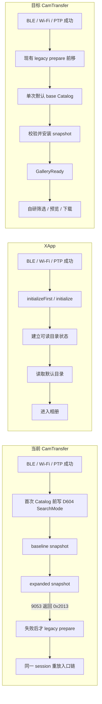
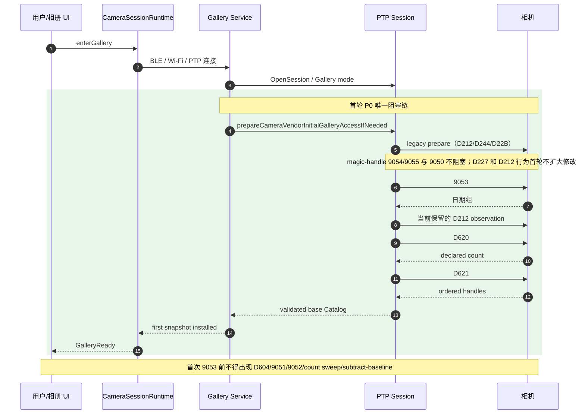
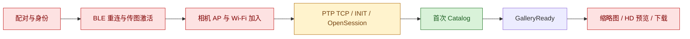

# iOS 无线相册入口稳定化最终技术方案

日期：2026-08-05（基于 2026-08-04 方案）
版本：v1.8
状态：Phase 1 入口、Phase 2 HEIF/视频与 D22B B 方案已完成源码/模拟器/build 验证；X-T5 已取得首次进入与筛选真机证据，X-M5、X-S20、GFX100RF 及 X-T5 re-entry/reconnect Gate 仍待验证
证据审计：`docs/ios-xapp-gallery-full-chain-difference-audit-20260804.md`
实施计划：`docs/superpowers/plans/2026-08-04-ios-gallery-entry-stabilization.md`

## 0. 文档定位

本文件是本次重构的唯一决策入口，回答六个问题：

1. CamTransfer 当前进入相册前怎么执行。
2. XApp 怎么执行，以及它的设计目的是什么。
3. 两者有哪些差异，这些差异当初为什么产生。
4. 本次每个改造点要解决什么问题，而不是为了照抄 XApp。
5. 哪些能力明确不属于本次重构。
6. 如何用自动化测试、日志契约和真机矩阵证明改造完整。

文档关系固定为：

- 本文件负责最终决策、范围和验收。
- `docs/ios-xapp-gallery-full-chain-difference-audit-20260804.md` 保留完整源码与日志证据、历史差异解释和详细时序。
- `docs/superpowers/plans/2026-08-04-ios-gallery-entry-stabilization.md` 负责逐步实现，不得自行扩大范围。

本次终点固定为：

```text
首次 base Catalog 成功并安装
-> GalleryReady
-> 用户正常进入相册
```

筛选、HEIF/RAW/Video enrichment、缩略图、预览、下载和后台行为均属于进入相册后的自研能力，不作为本次入口成功的阻塞条件。

## 1. 最终决策

本次不完整复制 XApp，也不只停留在差异对比。

最终方案是：

> 只修复“进入相册前”已经有直接证据的问题，把首次 Catalog 恢复成最小、单一、可验证的入口事务；进入相册后的筛选、HEIF 增强、缩略图、预览和下载继续使用 CamTransfer 自研架构。

首轮生产改造只包含：

- M1：首次 Catalog 前完成现有 legacy prepare。
- M2：从首次 Catalog 移除 D604 SearchMode 修改。
- M3：首次 Catalog 改为单次 base snapshot。
- M5：保留并强化 first Catalog installed 才 GalleryReady 的屏障。
- M6：删除同一 PTP session 中的 `0x2013` 同链重放。
- M10：保留现有 Runtime、Catalog owner、actor、generation 和 CommandLane。

首轮明确不修改：

- M7：D227 payload 宽度，证据不足。
- M8：`9053` 与 D620 之间的 D212，当前不是直接失败点，需单变量验证。
- BLE 保持/断开策略。
- 双卡切换逻辑。
- 缩略图、HD Preview、下载和后台链路。

## 2. 为什么采用这个方案

### 2.1 已确认事实

本次 X-M5 日志已经证明：

1. BLE 配对、重连和传图激活成功。
2. 手机成功加入相机 Wi-Fi。
3. PTP TCP、INIT 和 OpenSession 成功。
4. 第一个直接失败命令是首次目录的 `9053`。
5. 失败前 iOS 已写入 `D604=31`。
6. 第一次失败后才补跑 bootstrap。
7. recovery 之后仍再次写 `D604=31` 并再次执行 `9053`，结果仍为 `0x2013`。
8. 故障构建跳过 `9050` 后仍然失败，所以只改 `9050` 不能解决问题。

### 2.2 最小因果边界

当前最小、直接、可验证的问题不是整个连接架构，而是：

```text
首次 Catalog 前修改 SearchMode
+
首次 Catalog 前没有完成 legacy prepare
+
失败后在同一 session 重放相同入口链
```

因此首轮不能同时修改 D212、D227、BLE 生命周期和后续功能，否则无法判断哪个变量真正解决了问题。

### 2.3 三条流程一页对照



### 2.4 差异、历史原因和本次处理

| 差异 | 当初产生原因 | 当前影响 | 本次处理目的 |
|---|---|---|---|
| 首次 Catalog 前写 D604 | 为解决 HEIF 漏图、筛选能力和目录范围问题，把后置能力并进入口 | 部分机型在首次 `9053` 前处于非默认 SearchMode，入口变成高风险复合事务 | 把“能进入相册”和“完整筛选能力”解耦 |
| 首次读取两次 snapshot | 通过 baseline/expanded 差集补齐格式对象 | 首次进入时间和相机状态变化次数增加，任一步失败都无法进入 | 首次只建立一个可验证的 base Catalog |
| prepare 只在失败后执行 | 最初被设计成兼容性 recovery，避免影响已有成功机型 | 第一次请求可能发生在未准备状态，失败后又在污染状态中补救 | 让第一次请求就在准备完成的状态执行 |
| `0x2013` 后同 session 重放 | 希望自动恢复 StoreNotAvailable，减少用户重连 | 相机状态未知时重复同一事务，无法证明恢复有效，可能继续扩大状态污染 | 失败即收口并由上层重新建立干净 session |
| GalleryReady 与连接步骤接近 | 早期流程以连接完成为主，Catalog 后来逐步加重 | PTP 已连不等于用户真的能看到相册 | 只以当前 generation 的 Catalog 安装成功作为 Ready |
| 9050 曾位于入口 | 为提前取得筛选 descriptor | 当前入口不消费其结果，失败却曾阻塞相册 | 保持非阻塞，后续按真实功能需要异步加载 |

这里吸收的是 XApp 的“先初始化到稳定状态，再读取目录”的设计原则，不复制它的类结构、Repository 结构或所有命令序列。

## 3. 最终目标状态



### 3.1 GalleryReady 的唯一含义

只有以下条件全部满足才能发布：

- `9053` 成功并解析日期组。
- D620 成功并得到 declared count。
- D621 成功并得到有序 handles。
- declared count 等于 handles 数量。
- 日期组数量总和等于 handles 数量。
- handles 没有重复。
- Catalog snapshot 已安装到当前 session/generation。

PTP session 存在、Gallery mode 设置成功、Connection Step 完成，都不能单独表示 GalleryReady。

## 4. 首轮 P0 改造清单

| ID | 当前问题 | 改造目的 | 最小变化 | 非目标 | 验收 |
|---|---|---|---|---|---|
| M1 | legacy prepare 在首次 `9053` 失败后才执行 | 让第一次目录请求发生在已准备状态 | 在 `fetchInitialCameraCatalog()` 的 exclusive session mutation 内，先 prepare，再读取目录 | 不重写所有 handshake | prepare 日志早于首次 `9053`，每个 session 只执行一次 |
| M2 | 首次 Catalog 前写 `D604=31/2` | 去掉当前最直接的相机状态干扰 | `cameraVendorInitialCatalogSnapshot()` 不再发送 SearchMode payload | 不删除后续筛选能力 | 首次 `9053` 前无 D604/9051/9052 |
| M3 | 首次目录读取 baseline 和 expanded 两次 | 建立单一、原子的 base Catalog | 只调用一次 `requestCameraVendorSpecifiedObjectSnapshot(stage: "initial-camera-catalog")` | 不保证首屏立即拥有完整 HEIF 分类 | 只出现一次 `9053/D620/D621` transaction |
| M5 | 中间 evidence 名称可能被误解为 loaded | 保证用户可见 Ready 只有一个权威 | 保留 Runtime 的 Catalog gate并增加回归测试；首轮不重构 connection owner | 不把 Catalog 放回 loader | Catalog 未安装时 phase 始终为 `galleryLoading` |
| M6 | `0x2013` 后补 bootstrap 并重放相同入口链 | 避免继续污染未知相机状态 | 删除 `CameraVendorInitialCatalogBootstrapRecoveryPolicy` 和同 session retry | 不删除 busy/empty 等有证明的有限 retry | 同一 session 不出现第二次相同 initial Catalog 链 |
| M10 | 协议修复可能扩大成架构重写 | 保留已验证的并发和生命周期能力 | 只调整 service/session 发出的入口命令 | 不复制 XApp Repository/native 类结构 | 单 session owner、Catalog owner、generation fence 测试保持通过 |

## 5. 首轮明确保留的行为

为了保持单变量边界，首轮暂时保留：

### 5.1 D212

`CameraVendorCatalogWireRequestPolicy.shouldRefreshGalleryContextBeforeSpecifiedList` 首轮不修改。

原因：

- 当前失败发生在 `9053`，早于目录中的 D212。
- D212 是否是 legacy route 必需观察步骤尚无充分证据。
- 首轮同时删除它会扩大变量范围。

后续只有在 X-M5 入口成功后，才能进行“保留 D212 / 移除 D212”的 fresh-session A/B。

### 5.2 D227 payload

首轮不改变编码宽度。

原因：

- 当前代码存在宽度不一致，但尚未取得 native 类型、GetDevicePropDesc 或同机型成功 payload 证据。
- 错误修改属性宽度可能让更多机型无法进入或下载。

### 5.3 9050

隔离 worktree 当前已在入口跳过 `9050`，首轮继续保持不阻塞。

首轮不新增复杂的 post-ready descriptor UI；先验证入口链是否恢复。若入口成功，再单独实施后置筛选能力方案。

## 6. 分阶段交付

### Phase 0：冻结入口 wire contract

目标：先用测试定义首轮允许和禁止的行为。

必须新增或改写测试：

- prepare 必须早于 initial snapshot。
- initial snapshot 只读取一次目录。
- initial snapshot 不发送 SearchMode payload。
- `0x2013` 不触发同 session bootstrap recovery。
- first Catalog 未安装前不能 GalleryReady。
- 不修改 D212 policy 和 D227 编码。

### Phase 1：实施入口稳定化

修改：

- `ios/Runner/CameraVendorPtpSession.swift`
- `ios/Runner/CameraVendorRealtimeGalleryService.swift`
- `ios/Runner/CameraVendorCatalogPolicy.swift`
- `ios/RunnerTests/RunnerTests.swift`

不修改：

- `CameraSessionRuntime` 主状态机实现，除非测试发现当前 gate 被绕过。
- `CameraVendorGalleryMainlineSessionLoader` owner 边界。
- 筛选、缩略图、预览、下载文件。

### Gate 1：真机入口验收

必须使用新构建产生新日志：

- X-M5 单卡：首次进入、退出后再次进入、App 强杀后重新进入。
- X-T5：至少一次当前卡槽进入和重复进入。

只有 Gate 1 通过后，Phase 1 才算完成。

### Phase 2：GalleryReady 后能力增强

单独设计、单独实现：

- 9050 descriptor 异步加载。
- HEIF/RAW/Video enrichment。
- base Catalog 与 enrichment 的 snapshot 合并。
- 筛选能力 loading/ready/degraded 状态。

Phase 2 失败不能把已进入的相册退回连接失败。

### Phase 3：独立证据实验

每个实验必须单独 fresh session：

- M7：D227 payload 类型验证。
- M8：D212 保留/移除 A/B。
- 9050 前置/后置是否影响首次 `9053` 的 A/B。
- BLE 保持/断开是否影响 X-M5 的 A/B。

实验结果未经稳定复现，不进入生产路径。

## 7. 文件级最终设计

### `ios/Runner/CameraVendorPtpSession.swift`

- 保留 private legacy bootstrap 实现。
- 将 public 入口命名收口为 `prepareCameraVendorInitialGalleryAccessIfNeeded()`。
- `cameraVendorInitialCatalogSnapshot()` 改成单次 base snapshot。
- 保留 Catalog validation 和 placeholder item 构建。
- 删除 initial Catalog 中的 baseline、HEIF payload、SearchMode clear 和 expanded format hints。
- 删除 `recoverInitialCameraCatalogAfterStoreNotAvailable()`。

### `ios/Runner/CameraVendorRealtimeGalleryService.swift`

`fetchInitialCameraCatalog()` 在同一个 `runExclusiveSessionMutation` 内执行：

```text
prepareCameraVendorInitialGalleryAccessIfNeeded
-> cameraVendorInitialCatalogSnapshot
```

不再 catch `0x2013` 后重放。

### `ios/Runner/CameraVendorCatalogPolicy.swift`

- 删除 `CameraVendorInitialCatalogBootstrapRecoveryPolicy`。
- 保留 SearchMode、filter、count sweep 等后续功能策略。
- 首轮不修改 `shouldRefreshGalleryContextBeforeSpecifiedList`。

### `ios/RunnerTests/RunnerTests.swift`

- 将现有“失败后 bootstrap owner”测试改成“首次目录前 prepare owner”测试。
- 将现有“initial catalog baseline/expanded”测试改成“单次 base catalog”测试。
- 删除 StoreNotAvailable bootstrap recovery policy 测试。
- 保留并运行 GalleryReady gate、single owner、generation fence 测试。

## 8. 风险与控制

### 风险 1：首屏 HEIF 对象减少

控制：这是预期边界变化，不是静默丢功能。Phase 1 目标是恢复入口；Phase 2 负责后置 enrichment。

### 风险 2：legacy prepare 中某个辅助命令失败

控制：沿用现有 prime 的错误分类，不把“无当前图”统一升级为 transport failure。新日志必须记录失败命令和 response code。

### 风险 3：X-T5 原有成功路径回归

控制：X-M5 和 X-T5 都是 Gate 1 必测机型；不能只用 X-M5 成功作为完成证据。

### 风险 4：删除 recovery 后失败更快暴露

控制：这是有意行为。相同错误链重复执行没有恢复价值；明确失败比继续污染 session 更容易定位和安全重连。

### 风险 5：后续功能假设 initial Catalog 有 expanded format hints

控制：Phase 1 代码评审必须搜索 `extendedStillCandidate`、`expandedStillFormatHints` 和 initial snapshot 使用方；发现硬依赖时，只允许增加 post-ready capability loading 状态，不允许把 D604 放回入口。

## 9. 自动化验收

### 聚焦测试

必须通过新增的入口 contract 测试，以及现有：

- `testCameraSessionRuntimeDoesNotPublishGalleryReadyBeforeInitialCatalogInstalls`
- `testCameraSessionRuntimePublishesGalleryReadyAfterInitialCatalogInstalls`
- legacy bootstrap owner 测试的改写版本。
- initial Catalog source 测试的改写版本。
- session/generation/catalog owner 相关测试。

### 全量验证

- 完整 `RunnerTests`，记录执行数和失败名称。
- iOS Simulator Debug build。
- generic iOS device build。
- 不把仓库既有失败算成本次通过；必须和实施前基线比较。

## 10. 真机日志验收

成功日志必须满足：

```text
PTP_INITIAL_GALLERY_ACCESS_PREPARE_END
早于
PTP_INITIAL_CAMERA_CATALOG_BEGIN

legacy route 还应包含：
PTP_GALLERY_BOOTSTRAP_COMPLETE

首次 Catalog 期间：
无 cameraVendorSetSearchModeAll
无 D604=31
无 D604=2
无 INITIAL_CATALOG_BASELINE
无 INITIAL_CATALOG_EXPANDED

有且仅有一次：
PTP_INITIAL_CAMERA_CATALOG_9053
PTP_INITIAL_CAMERA_CATALOG_D620
PTP_INITIAL_CAMERA_CATALOG_D621

最终：
PTP_INITIAL_CAMERA_CATALOG_END
first snapshot installed
GalleryReady
```

失败日志必须满足：

- 保留第一个失败命令、response code、session ID 和 generation。
- 不出现 `PTP_INITIAL_CAMERA_CATALOG_BOOTSTRAP_RECOVERY`。
- 不在同一 session 中再次启动相同 initial Catalog。

## 11. 完成和停止条件

### Phase 1 完成

同时满足：

1. 入口 contract 测试通过。
2. full RunnerTests 与基线相比没有新增无关失败。
3. simulator 和 device build 通过。
4. X-M5 三个入口场景成功。
5. X-T5 入口和重复进入成功。
6. 新日志证明首次 Catalog 前没有 D604。
7. 新日志证明同一 session 没有 `0x2013` 同链重放。

### 必须停止并重新评审

出现以下任一情况，不继续叠加补丁：

- 无 D604、prepare 前置后，首次 `9053` 仍稳定返回 `0x2013`。
- X-M5 成功但 X-T5 稳定回归。
- 首次 Catalog 成功但 Runtime 没有安装 snapshot。
- 需要修改 D227、D212、BLE 生命周期才能继续。

此时进入 Phase 3 单变量实验，不允许把多个假设合并到一个生产 patch。

## 12. 历史日志覆盖审计

### 12.1 直接结论

不能承诺本方案解决历史日志中的全部连接问题。

这里必须区分两个对象：

- **整体新架构**：配对、BLE、Wi-Fi、PTP、Catalog、Runtime、媒体子任务和生命周期的分层 owner/状态机。
- **当前 Phase 1 / P0 patch**：只修改首次 Catalog 协议事务。

对历史日志反向检查后的结论是：整体新架构已经接住了大多数旧故障类型；P0 没有必要重复改造这些层。当前仍缺少正确生产实现的主链阻断点，集中在首次 Catalog 这一族问题。

当前 Phase 1 / P0 的严格覆盖边界是：

```text
BLE、Wi-Fi、PTP INIT、OpenSession 已成功
-> 首次 Catalog 开始
-> 首次 Catalog 成功安装
-> GalleryReady
```

因此：

- 对“`9050` 被错误当成入口硬门槛”的失败，P0 会直接移除该阻塞条件。
- 对“首次 Catalog 前状态被修改、首次 `9053` 返回 `0x2013`、重放相同错误链”的失败，P0 是当前直接修复方案，但仍需 X-M5 真机新日志证明。
- 对“首次 Catalog 执行多轮格式扫描并超时”的失败，P0 通过单次 base snapshot 明显缩小风险，但不能在没有真机验证时宣称完全解决。
- 对配对、BLE 激活、Wi-Fi 加入、PTP TCP/INIT、相册后的缩略图/预览/下载断线，P0 不做修改，也不能宣称覆盖。

历史日志用于证明“故障种类和边界”，不能替代改造后真机证明。

### 12.2 全链路故障域与 P0 覆盖



| 故障域 | 历史表现 | 当前 P0 覆盖 | 原因 |
|---|---|---:|---|
| 配对/身份 | 旧系统配对、相机删除配对、ACK 超时、选中相机身份不一致 | 无 | 发生在进入相册流程之前，P0 没有修改 bond、identity、secure handshake |
| BLE 重连/激活 | GATT 断开、已配对相机扫描不到、传图模式唤醒失败 | 无 | P0 保持 BLE 生命周期和激活策略不变 |
| Wi-Fi 加入 | hidden network 超时、系统 Wi-Fi 回调超时、无 IPv4 | 无 | P0 从 PTP session 已建立后开始生效 |
| PTP transport | `Connection refused`、`No route to host`、INIT ACK 超时、Android bind `EPERM` | 无 | 这些错误发生在 Catalog 命令之前 |
| `9050` 入口硬门槛 | `9050 -> 0x2019` 被升级成 `loadGallery` 失败 | 直接覆盖该门槛 | P0 不再让 `9050` 阻塞首次进入；不等于解决所有 camera busy |
| 首次 Catalog 状态/顺序 | `9053 -> 0x2013`、失败后 bootstrap、同 session 重放 | 直接目标，待真机证明 | M1/M2/M3/M6 正是针对该链路 |
| 首次 Catalog 多格式扫描 | ALL/JPG/HEIF/MOV 连续超时 | 部分覆盖，待真机证明 | 单次 base snapshot 删除入口格式 sweep，但底层 transport 超时仍可能存在 |
| GalleryReady 后媒体链 | `9054 -> 0x2009`、HD preview EOF、缩略图/下载取消 | 无 | 属于相册内能力，不在“只保证进入相册”的 P0 范围 |
| 生命周期/恢复 | pairing probe offline、前后台切换、重入与终止 | 无 | 需要独立的生命周期和恢复验收，不应塞进 Catalog patch |

### 12.3 18 份历史日志逐文件覆盖矩阵

日志目录：`/Users/g01d-01-1224/Desktop/传图/日志`

“覆盖”表示代码改造命中该失败机制，不表示尚未实施的方案已经通过真机验证。

| 日志文件 | 关键证据 | 实际故障层/结果 | 整体新架构反向检查 | P0 关系 |
|---|---|---|---|---|
| `20260704诊断日志.log` | `:261` Wi-Fi 回调超时；`:382` `9050 -> 0x2019`；`:416` PTP refused；`:428` 最终失败 | 混合：Wi-Fi/9050/PTP transport，最终未进入 | 已有 Wi-Fi callback 后证据检查、`9050` 非阻塞、PTP 有界重试和 reset；需 X-T30III 真机回归 | 只负责首次 Catalog/`9050` 部分 |
| `CamTransfer-Diagnostics-2026-07-04T03-58-33Z.log` | `:797` `Peer removed pairing information` | 配对/身份失败 | 已覆盖：识别为 stale system bond，清除 remembered pairing，并硬门禁提示系统蓝牙清理 | 无需进入 P0 |
| `CamTransfer-Diagnostics-2026-07-04T07-09-58Z.log` | `:304` PTP refused；`:328` route 失败 | PTP listener/transport 未就绪 | 已覆盖处理：5 次有界重试；耗尽后归属 `ConnectPtp` 并要求 reset，而不是误判 Catalog | 无需进入 P0 |
| `CamTransfer-Diagnostics-2026-07-05T13-39-21Z.log` | `:376` `9050 -> 0x2019`；`:392` 起 ALL/JPG/HEIF/MOV 超时 | 首次 Catalog 前置重链/格式扫描失败 | 未完全覆盖：属于与最新 X-M5 相同的首次 Catalog 重链问题族 | P0 直接处理；需 X-S20 真机证明 |
| `CamTransfer-Diagnostics-2026-07-05T14-04-46Z.log` | `:575` official confirmed；`:576` route 成功 | X-T5 成功基线 | 已成功；作为 PTP/Catalog 回归基线保留 | 不改行为 |
| `CamTransfer-Diagnostics-2026-07-11T12-28-57Z.log` | `:597` route 成功；`:600` GalleryReady；`:803` thumbnail cancellation | 已进入相册，后续缩略图任务取消 | 已覆盖：取消不发布失败 UI、不升级为 session transport loss | 无需进入 P0 |
| `CamTransfer-Diagnostics-2026-07-15T08-17-00Z.log` | `:19` `Peer removed pairing information` | 配对/身份失败 | 已覆盖：同 stale bond 门禁和清理动作 | 无需进入 P0 |
| `CamTransfer-Diagnostics-2026-07-31T16-20-48Z.log` | `:766` transient `No route to host`；`:922` official confirmed；`:2226` HD preview EOF | 重试后进入成功；相册后预览断线 | 已覆盖：PTP 短失败重试；HD EOF 归类 session terminal、停止后续 pump、generation fence 和 Runtime recovery | 无需进入 P0 |
| `CamTransfer-Diagnostics-2026-07-31T16-36-38Z.log` | `:272` transient `No route to host`；`:344` official confirmed | PTP 重试后进入成功 | 已有历史真机成功证据，当前测试锁定有界重试 | 不改行为 |
| `CamTransfer-Diagnostics-2026-08-02T06-40-29Z.log` | `:2149` 加密链路阶段 BLE 断开；`:2516` 后续配对成功；`:2606` probe offline | 配对/记忆相机探测与重连 | 已覆盖：endpoint/serial 身份门、generation-bound handshake、一次恢复重连、probe 不重启相册协议 | 无需进入 P0 |
| `CamTransfer-Diagnostics-2026-08-02T13-18-15Z.log` | `:912` INIT ACK 超时；`:1041` route 失败 | GFX100RF PTP INIT/transport 失败 | 处理已覆盖：client-IP legacy/plain legacy fallback、PTP 有界重试、`ConnectPtp` reset；GFX100RF 成功兼容仍缺新真机证明 | 无需扩大 P0；列入真机矩阵 |
| `CamTransfer-Diagnostics-2026-08-03T07-19-22Z.log` | `:4619`/`:5168`/`:5770` 最终 `9050 -> 0x2019`；同文件有 `9053 -> 0x2013` recovery | X-M5 首次 Catalog 入口链失败 | 部分覆盖：最新 worktree 已让 `9050` 非阻塞；`9053` 同 session recovery 仍是缺口 | P0 核心范围 |
| `CamTransfer-Diagnostics-2026-08-03T13-45-44Z.log` | `:6367`/`:6948` `9053 -> 0x2013`；`:6491`/`:7072` 最终失败 | X-M5 PTP 已成功，首次 Catalog 失败 | 未覆盖：当前代码仍先跑双 snapshot，失败后才 prepare 并同 session 重放 | P0 首要阻断点 |
| `chat_file_1040g3c8320qtq9vhls0g5of5rhl41pnd2veol8g_camtransfer-diagnostic-export.txt` | `:94` Android Wi-Fi 失败；`:151` PTP refused | Android Wi-Fi/PTP transport 失败 | Android 当前已有 exact-network 重试、manual guidance、PTP 有界重试；需 X-H2S 真机回归 | 不属于 iOS P0 |
| `chat_file_1040g3c8320rbu2p55m605p97fj1amn34cv5fmt8_camtransfer-diagnostic-export.txt` | `:537` GATT disconnected；`:713` pairing confirmation timeout | Android BLE/配对失败 | Android 当前已结构化归属 GATT/Pairing gate，并提供 RetryStep/ResetConnection | 不属于 iOS P0 |
| `chat_file_1040g3c8320rsl72n686g5nsfl4s08asf9ou3on8_camtransfer-diagnostic-export.txt` | `:71` 起连续 5 次 Wi-Fi timeout | Android Wi-Fi 加入失败 | Android 当前按 exact network 有界重试，失败后保留凭据并进入手动引导 | 不属于 iOS P0 |
| `chat_file_1040g3c8321tulras7a505nsfl4s08asfad83i1o_camtransfer-diagnostic-export.txt` | `:24` remembered BLE timeout；`:731` 身份不一致；`:984` PTP reset；`:111` 起 `9054 -> 0x2009` | Android 多故障域 | 当前 Android 已拆分身份、BLE、PTP 和 item-level 缩略图错误，不再统一包装成连接失败；仍需该机型回归 | 不属于 iOS P0 |
| `chat_file_1040g3c83228b8eji7u605ndeejm087f4cpvlvv0_camtransfer-diagnostic-export.txt` | `:34` secure pairing write 失败；`:178` 起 bind `EPERM` | Android 配对和 socket-network bind 失败 | 当前 Android PTP 使用已连接 `Network.socketFactory` 创建 socket，不再走日志中的后绑定路径；配对冲突归属 reset | 不属于 iOS P0 |

### 12.4 整体架构必须保持的终态拆分

不能把所有问题继续堆进 `loadGallery`，也不能用一个“大重试”掩盖不同层的根因。完整连接架构应保持一个总状态机，并按六个边界独立验收。这里是回归边界，不表示六项都要重新实施：

| 边界 | 目的 | 解决的日志类别 | 当前状态 | 不应影响 |
|---|---|---|---|---|
| C1 配对与身份可靠性 | 统一本地记录、系统 bond、相机端身份和 secure ACK 的一致性 | stale bond、peer removed、pairing timeout、身份错配 | 已有结构覆盖 | Wi-Fi/PTP/Catalog |
| C2 BLE 激活与 AP readiness | 明确相机是否已收到传图授权并真正启动 AP | GATT 断开、扫描不到、激活超时 | 已有结构覆盖 | Catalog 命令 |
| C3 Wi-Fi handoff 与 PTP listener readiness | 区分“已加入 SSID”“已有 IPv4”“到相机可达”“PTP listener 已监听” | hidden network timeout、callback timeout、no route、refused、INIT ACK timeout | 已有处理覆盖；机型兼容待真机 | 相册内媒体逻辑 |
| C4 Initial Catalog 稳定化 | 建立单次、原子、可验证的首次目录事务 | `9050` 门槛、`9053/0x2013`、格式 sweep timeout | `9050` 已调整，核心 P0 待实施 | 配对、Wi-Fi、下载 |
| C5 相册后媒体传输终止态 | 对 EOF/reset/cancel 做 session termination、generation fence 和可重入恢复 | `9054/0x2009`、HD preview EOF、下载中断 | 已有结构覆盖 | 首次进入相册 |
| C6 生命周期与重入 | 统一前后台、锁屏、页面退出、App 重启后的 owner 和恢复入口 | probe offline、后台终止、重复进入 | 已有结构覆盖 | 不从页面生命周期重启完整协议 |

当前只实施 C4。C1/C2/C3/C5/C6 进入历史日志回归清单，除非自动化或新真机日志证明存在缺口，否则不重新改造。C4 保持独立，是为了验证 X-M5/X-S20 的直接阻断点；其他层不能混入同一个 patch，否则成功后无法判断真正生效的是哪个改动。

### 12.5 如何证明“解决彻底”

每个工程都必须同时满足：

1. 对应历史错误可映射到唯一失败阶段，不能统一包装成“连接失败”。
2. 为该阶段增加可注入的失败测试，验证 retry、reset、终止和错误归属。
3. 前一阶段成功证据不能代替后一阶段成功，例如 PTP OpenSession 不能代替 Catalog 成功。
4. X-M5、X-T5、X-S20、GFX100RF 等历史机型按涉及的故障域执行真机矩阵。
5. 新日志必须记录 session、generation、step、首个失败命令、response/error、retry origin 和最终结果。
6. 只有新构建在对应真机场景稳定通过，才把矩阵中的“待证明”改成“已覆盖”。

因此当前最准确的项目结论是：

> P0 有望解决 X-M5 首次 Catalog 失败和旧版本 `9050` 阻塞，并降低 X-S20 首次格式扫描超时风险；它不是全连接链路重写。整体架构已经按 C1-C6 分层，当前应保持旧边界并只补 C4 的直接缺口。

### 12.6 当前新架构反向审计结果

审计基线：

- iOS：`/Users/g01d-01-1224/.config/superpowers/worktrees/camtransfer/codex/ios-red-app-info-handshake` 当前未提交工作区。
- Android：`/Users/g01d-01-1224/Documents/camtransfer` 当前源码。
- 日志：18 份历史导出，不把旧构建失败直接当成当前构建仍失败。

| 故障类别 | 当前机制 | 自动化证据 | 结论 |
|---|---|---|---|
| stale bond / peer removed | 系统 bond 清理硬门禁、清 remembered pairing、registration consistency | iOS pairing policy；Android registration policy | 已有结构覆盖 |
| remembered identity / GATT / handshake race | endpoint + serial identity gate、generation-bound callback、一次恢复重连、App identity ACK | iOS handshake/reconnect tests | 已有结构覆盖；需新构建真机回归 |
| AP activation | 必须有 activation ACK 和 AP ready 正向证据，策略失败后有限 fallback | iOS transfer activation tests | 已有结构覆盖 |
| Wi-Fi callback/association timeout | callback timeout 后继续检查 SSID/IPv4；Android exact-network 有界重试 | iOS Wi-Fi tests + Android connection tests | 已有结构覆盖 |
| PTP no route/refused | 5 次有界重试、generation 检查、耗尽后 `ConnectPtp/reset` | iOS PTP tests + 历史 X-T5 重试成功 | 已有结构覆盖 |
| PTP INIT ACK timeout | client-IP legacy 和 plain legacy 两种 INIT；失败归属 PTP 而非 Catalog | iOS/Android init policy tests | 处理覆盖；GFX100RF 兼容待真机 |
| `9050 -> 0x2019` | bootstrap 和 empty recovery 不再调用无后续用途的 descriptor | iOS `9050_SKIPPED` tests | 最新 worktree 已覆盖，尚未作为发布构建验收 |
| `9053 -> 0x2013` / format sweep timeout | 已前移 legacy prepare；首次 Catalog 改为单 base snapshot；删除同 session replay；持久化格式筛选只能在 base ready 后恢复；可选 9054/9055 current-image primes 不再阻塞入口 | 16 个入口/re-entry/时延契约聚焦测试通过，完整 RunnerTests 无本次新增失败 | **生产实现已完成；X-M5/X-S20 真机因果 Gate 待验证** |
| thumbnail/HD EOF/reset | 统一 disposition、terminal latch、停止 pump、generation fence、Runtime recovery | iOS transport pipeline tests | 已有结构覆盖 |
| cancellation / lifecycle / probe | cancellation 不升级故障；页面不重启协议；probe 与 active session 隔离 | iOS lifecycle/runtime tests | 已有结构覆盖 |
| Android bind `EPERM` | PTP socket 由 `Network.socketFactory` 创建 | Android source + init fallback tests | 当前路径已替代旧后绑定实现 |

### 12.7 本次执行的覆盖验证

iOS Simulator 定向验证：

```text
第一组：22 tests, 0 failures
第二组：14 tests, 0 failures
合计：36 tests, 0 failures
```

覆盖配对身份、App identity ACK、Wi-Fi callback、IPv4 readiness、PTP retry、INIT variants、`9050` 非阻塞、GalleryReady gate、HD/thumbnail transport loss 和 Runtime recovery。

Android JVM 定向验证：

```text
CameraConnectionFlowTest: 18
CameraVendorPairingRegistrationPolicyTest: 11
CameraSessionKeepAliveArchitectureTest: 24
PtpConnectionInitFallbackTest: 2
CameraVendorPtpInitPolicyTest: 2
合计：57 tests, 0 failures
```

这些结果证明当前源码存在对应处理契约，但不证明任意相机固件和手机组合一定成功。

### 12.8 当前真正需要继续优化的范围

按历史日志和当前源码，下一步不应再次重构配对、BLE、Wi-Fi、PTP retry 或媒体 Runtime。当前状态和后续应集中在：

1. M1/M2/M3/M5/M6 已完成生产实现和自动化验证；保持当前变更边界，不继续叠加协议变量。
2. 把历史日志签名固化成 `HistoricalConnectionFailureContractTests`，防止后续把旧问题重新引入。
3. 用 X-M5、X-S20、X-T5、GFX100RF 执行新构建真机回归；其中 GFX100RF 主要验证 PTP INIT，X-M5/X-S20 验证首次 Catalog。
4. 只有真机显示同一失败按机型稳定分化时，才增加真正的 capability profile；当前 `currentBaseline` 改名并不等于已经实现机型能力分发。

所以更准确的最终判断是：

> 从架构、源码和自动化契约看，首次 Catalog 的准备顺序、SearchMode 状态和同 session recovery 已完成 P0 生产改造。剩余工作重点是用新构建对旧故障做真机回归证明，而不是继续扩大架构改造。

### 12.9 2026-08-04 实施状态与验证结果

实施环境：

```text
worktree: /Users/g01d-01-1224/.config/superpowers/worktrees/camtransfer/codex/ios-red-app-info-handshake
branch: codex/ios-gallery-entry-catalog-refactor
base HEAD: 3e53c3a20102bbc57f29e945e246cd2e65c8beb7
delivery state: uncommitted working-tree changes, no commit, no push
```

生产实现状态：

| 措施 | 实际状态 | 证据边界 |
|---|---|---|
| M1 | 已完成 | `fetchInitialCameraCatalog()` 在同一 exclusive session mutation 内先调用 `prepareCameraVendorInitialGalleryAccessIfNeeded()`，再请求 initial Catalog |
| M2 | 已完成 | `cameraVendorInitialCatalogSnapshot()` 不再构造或写入任何 `CameraVendorSearchModeAllPayload` |
| M3 | 已完成 | 首次 Catalog 只调用一次 `requestCameraVendorSpecifiedObjectSnapshot(stage: "initial-camera-catalog")`，校验后生成 base placeholders |
| M5 | 已验证、未改 Runtime | 既有“安装当前 generation Catalog 后才 GalleryReady”测试通过；`CameraSessionRuntime` 未修改 |
| M6 | 已完成 | 删除 StoreNotAvailable recovery policy、recovery API 和同一 PTP session 的第二次 initial Catalog 请求 |
| M10 | 已保持 | `CameraGallerySession` 固定先安装 `.all` base，再恢复持久化 JPG/RAW/HEIF 筛选；新增 Catalog-transaction-only wait，避免等待 thumbnail/details；`CameraSessionRuntime`、单 Catalog owner、actor/generation fence、`CameraCommandLane` 和 loader/lifecycle 边界未改 |

TDD 证据：

```text
RED: 3 tests executed, 13 expected assertion failures
  - recovery policy/API still existed
  - prepare still occurred only after the first Catalog failure
  - initial Catalog still performed two snapshots and D604 mutation

RED persisted-filter re-entry: 1 test executed, 6 expected assertion failures
  - JPG, RAW and HEIF each started with a filtered request
  - all three skipped the initial/base Catalog

RED catalog-only wait: compile failed at the two expected missing API call sites
  - no `waitUntilCatalogIdle()` boundary existed
  - the only wait also joined thumbnail/details work

GREEN focused: 16 tests executed, 0 failures
  - new wire-contract tests
  - GalleryReady install gate
  - single Catalog owner / superseded-generation join
  - base initial Catalog consumers
  - persisted JPG/RAW/HEIF re-entry installs base first and restores the filter only after the first ready publication
  - suspended thumbnail work does not delay persisted-filter restoration
```

完整 iOS 验证：

```text
RunnerTests: 1112 executed
passed tests: 1110
failed tests: 2, containing 3 assertion failures

remaining failure names:
- testRunnerInfoPlistDeclaresBackgroundModesForCameraKeepAlive
- testRunnerInfoPlistExcludesLocationUsageDescriptions
```

这两个失败单独复跑后稳定复现，断言的是现有 `Info.plist` 中 location usage descriptions 和 background-mode 基线；本次没有修改 `Info.plist`、entitlements、后台或定位代码，因此不把它们计作本次 Catalog 重构回归，也不在本任务内修复。

Build / install 证据：

```text
iPhone 16 / iOS 18.4 simulator build: BUILD SUCCEEDED
generic iOS device build with signing disabled: BUILD SUCCEEDED
iPhone 17 signed generic device build: BUILD SUCCEEDED
previous slow-entry build install: succeeded, com.camtransfer.app 1.0 (6)
corrected slow-entry build install: succeeded at 2026-08-04 18:56 on iPhone 952611F0-557B-5C5F-BF1F-265474E9BC4B; bundleID=com.camtransfer.app
automatic launch: denied because the phone was locked; unlock/manual launch and camera timing verification pending
```

剩余真机 Gate：

| 机型 | 当前状态 | 必须补充的证明 |
|---|---|---|
| X-M5 | 待验证 | clean entry、正常退出后 re-entry、force-kill 后 re-entry；首个 `9053`、D620/D621、GalleryReady 顺序 |
| X-S20 | 待验证 | 首次 Catalog 不再发生入口格式 sweep timeout，base snapshot 可安装 |
| X-T5 | 待验证 | 当前成功路径 entry / re-entry 无回归 |
| GFX100RF | 待验证 | 重点验证既有 PTP INIT/fallback；随后确认 base Catalog 入口 |

当前已取得 X-T5 慢入口根因日志和 corrected iPhoneOS build，但修复包尚未重新安装；X-M5 等其他机型也没有新日志。因此不能把 X-M5 的 `0x2013` 根因或 Phase 1 物理 Gate 标记为已通过。

与实施计划的偏离共有三项：

1. 按用户安全约束跳过计划内全部 commit 步骤，未提交、未 push。
2. 初版 signed build/install 后，X-T5 真机暴露约 26 秒入口回归；修复版已于 2026-08-04 18:56 安装到目标 iPhone。自动启动因手机锁屏被拒绝，因此 X-M5/X-T5 及扩展机型 Gate 仍保持待验证。未因此修改 D212、D227、BLE、D244、9050 后置 UI、筛选、HEIF enrichment、缩略图、预览、下载或后台行为。
3. 独立审查证明 `CameraGallerySession.enter()` 会用持久化 JPG/RAW/HEIF intent 绕过 planned base Catalog，因此额外修改 `CameraGallerySession.swift` 和 `CameraGalleryCatalogRuntime.swift` 的入口 sequencing/wait boundary：先 `.all` base 并只等待 Catalog transaction ready，再恢复既有筛选，不等待 thumbnail/details。没有修改筛选 query、筛选 UI、HEIF membership 算法或 Runtime owner。

### 12.10 X-T5 真机慢入口回归与修正

2026-08-04 18:06 从当前 iPhone 17 App 容器拉取的 `camtransfer_debug.log` 与 `cameraVendor-fast-debug.log` 证明，初版 M1 将整个历史 legacy bootstrap 无条件前移后，X-T5 的入口耗时主要消耗在可选 current-image prime，而不是首次 Catalog：

```text
18:05:30.975 PTP_INITIAL_GALLERY_ACCESS_PREPARE_BEGIN
18:05:31.001 PTP_GALLERY_BOOTSTRAP_9054
18:05:45.726 9054 totalMs=14720
18:05:45.737 PTP_GALLERY_BOOTSTRAP_9055
18:05:53.208 9055 totalMs=7465
18:05:53.221 PTP_GALLERY_BOOTSTRAP_D22B
18:05:56.991 D22B totalMs=3763
18:05:57.028 PTP_INITIAL_GALLERY_ACCESS_PREPARE_END
18:05:57.029 PTP_INITIAL_CAMERA_CATALOG_BEGIN
18:05:57.601 PTP_INITIAL_CAMERA_CATALOG_END mode=base handles=1813
```

结论：prepare 共约 26.05 秒；其中 magic handle `0x10000001` 的 `9054`/`9055` 占约 22.19 秒，首次 base Catalog 仅约 0.57 秒。该结果与仓库已有 X-T5 证据一致：current-image/current-thumbnail prime 是诊断或预加载能力，不是首屏 Catalog 的硬门槛；阻塞它们不会改善目录结果。

修正范围：

- 保留首次 Catalog 前的 D212 #2、D244、D22B、D212 #3 prepare 边界。
- 首次入口记录 `PTP_GALLERY_BOOTSTRAP_9054_SKIPPED` 和 `PTP_GALLERY_BOOTSTRAP_9055_SKIPPED`，不再发送两个 magic-handle prime。
- 不修改列表项缩略图进入 GalleryReady 后按真实 handle 使用 9054/ObjectInfo 的媒体链。
- 不修改 D212、D227、BLE、D244 setter、SearchMode、Catalog owner 或 GalleryReady gate。

TDD 结果：新时延契约先以 1 test / 4 expected failures 进入 RED，生产代码修正后通过；入口聚焦组更新为 16/16。完整 RunnerTests 更新为 1112 executed、1110 passed，仍只有原有 2 个 Info.plist 测试的 3 个断言失败。

修复版已完成 signed generic iPhoneOS build，并于 2026-08-04 18:56 成功安装到目标 iPhone。CoreDevice 返回 bundle ID `com.camtransfer.app`；自动启动仅因手机锁屏被拒绝。解锁/手动启动后的 X-T5 时延复测是当前最近 Gate。

### 12.11 用户批准的 HEIF 与视频 Phase 2 实施结果

用户在 corrected X-T5 入口速度恢复后确认：默认“全部”只有 base 1813 项，而 HEIF 筛选可得到更大的成员集合；随后明确批准同时支持 HEIF 与单一“视频”筛选。Phase 2 没有改变首次入口事务：首次 generation 仍只安装 base snapshot，`GalleryReady` 仍在任何 D604 格式查询前发布。

当前生产实现：

- `CameraCatalogQueryEngine.resolveInitial()` 单独读取并缓存首次 base；普通 `resolve(.all)` 才在 Ready 后合并 base、HEIF 与视频 membership。
- HEIF 使用现有 subtract-baseline；视频产品格式 `.video` 在物理层分别执行 MOV `0x0004` 与 MP4 `0x0008` 查询，去重后合并为一个“视频”筛选。
- `CameraGallerySession.enter()` 等待 base Catalog 安装后立即保留 Ready，并异步启动 post-ready ALL enrichment，不发布新的 loading。
- 安装 enrichment 前再次校验 session、generation、snapshot 和 camera-membership intent；日期、排序、下载状态等本地投影变化不会丢失 enrichment，真正切换 JPG/RAW/HEIF/视频 membership 或 generation 失效后，迟到结果仍不能覆盖当前 Catalog。
- 普通 HEIF/视频筛选查询完成时，如果同一 membership 下用户又修改了日期、排序或下载状态，安装过程保留最新本地 intent，不会被事务启动时的旧 intent 覆盖。
- retryable 筛选失败只使用稳定 Ready 的 identity 与 intent 作为回退锚点，并从当前 Repository 重建 presentation；已完成的缩略图、ObjectInfo、方向与格式详情不会回退到旧快照。
- 非终端 enrichment 失败保留 base Ready；确定的 transport loss 仍上报 `CameraSessionRuntime` 的既有终止证据路径。
- source adapter 统一用 `.catalog` 上下文分类普通 transport error，HEIF/MOV/MP4 查询遇到 socket EOF/closed 时保留 `provesTransportLost=true`，不再在 Runtime 前丢失终止证据。
- 相册 chips 增加一个“视频”；统一 `isSupportedStill` 根据 `.video` hint、VIDEO/MOV/MP4 label 和 MOV/MP4 扩展名阻止选择、照片预览、HD Preview 与原图下载。目录可筛选视频，但没有新增视频预览、缩略图、下载或后台能力。
- 为防止共享 `.all` 意外扩大快速下载，`CameraAutoDownloadRule.catalogFilter` 将快速下载“全部格式”固定为 JPG/RAW/HEIF；显式 video-only 规则在 Catalog 查询和下载提交前拒绝。相册 ALL 仍包含视频，Quick Download 不包含视频。
- video-only 拒绝复用既有 Quick Download completion policy：`disconnectAfterDownload=false` 保持 `GalleryReady` 并回相册，`true` 终止 transport 并回首页；两条路径都不会提交下载。

新增与更新的自动化证据：

```text
HEIF/video query and source: 3/3
base Ready before enrichment + late generation fence: 2/2
post-ready retryable/terminal failure behavior: 2/2
Quick Download ALL excludes video: RED 2 tests / 4 assertions, GREEN 2/2
affected Catalog/Session/UI/entry group: 59/59
downstream admission tests after intentional base->enriched generation change: 7/7
review closure focused group: 13/13
- production adapter terminal transport evidence: 2/2
- still-only selection/download/photo-preview/HD-preview/Quick Download gates: 5/5
- local sort projection during enrichment plus stale membership rejection: 2/2
final focused entry/enrichment/download-routing group: 19/19
second review concurrency closure: RED 2 tests / 5 assertions, GREEN 2/2
expanded Gallery/Catalog regression group after final fixes: 49/49

full RunnerTests: 1136 executed
passed test cases: 1134
remaining failures: 2 existing Info.plist tests, 3 unchanged assertions
expanded xcresult: /Users/g01d-01-1224/Library/Developer/Xcode/DerivedData/Runner-dwsgnyalvqkhopglgncegafkfthg/Logs/Test/Test-Runner-2026.08.04_23-29-18-+0800.xcresult
final xcresult: /Users/g01d-01-1224/Library/Developer/Xcode/DerivedData/Runner-dwsgnyalvqkhopglgncegafkfthg/Logs/Test/Test-Runner-2026.08.04_23-29-35-+0800.xcresult
```

Build 与安装边界：

```text
generic iOS build, signing disabled: BUILD SUCCEEDED
signed generic iOS build: BUILD SUCCEEDED
bundle: com.camtransfer.app 1.0 (6)
TeamIdentifier: 27C9C4H26H
latest install retry after review fixes: failed before transfer because target iPhone was unavailable
CoreDevice error: 1011, unable to locate requested device
fresh unsigned and signed generic builds: BUILD SUCCEEDED at 2026-08-04 23:30
signed app: /Users/g01d-01-1224/Library/Developer/Xcode/DerivedData/Runner-dwsgnyalvqkhopglgncegafkfthg/Build/Products/Debug-iphoneos/Runner.app
```

因此当前可以确认源码、模拟器测试、generic build 和 signed build；不能确认最新 Phase 2 包已安装，也不能用旧日志代替 fresh X-T5 验收。手机重新可用后仍需证明：首次 base Ready 不等待 D604，Ready 后出现 HEIF、MOV、MP4 查询，ALL 最终集合为去重并集，HEIF 与视频筛选集合正确，入口耗时不恢复到几十秒。

本阶段相对原 Phase 1 计划的唯一批准扩展是 HEIF/video post-ready Catalog membership 与相册筛选。审查后对选择、照片/HD 预览和 Quick Download 的改动仅用于阻止新增视频目录成员进入既有 still-only 能力，不实现视频能力。第二轮审查只修复同 membership 本地 intent 竞态和 Ready 回退内容陈旧，不新增 owner、兼容分支或生命周期边界。D212、D227、D244、BLE/Wi-Fi/PTP INIT/retry、9050 后置 UI、视频缩略图/预览/下载和后台行为均未扩大修改。

### 12.12 D22B 单变量 B 包实验状态

2026-08-05 13:36 从目标 iPhone 当前 A 包拉取 fresh `cameraVendor-fast-debug.log`。X-T5 最近一次成功入口的直接时序为：

```text
05:34:59 WIFI_JOIN_START
05:35:08 WIFI_HANDOFF_RESULT didComplete=true
05:35:08 PTP_OPEN_SESSION_OK
05:35:09 PTP_INITIAL_GALLERY_ACCESS_PREPARE_BEGIN
05:35:09 PTP_GALLERY_BOOTSTRAP_D22B
05:35:13 D22B requestToFirstByteMs=3682 totalMs=3687
05:35:13 PTP_INITIAL_CAMERA_CATALOG_BEGIN
05:35:13 PTP_INITIAL_CAMERA_CATALOG_END mode=base handles=1813
05:35:14 GalleryReady
```

A 包证据路径：`/private/tmp/camtransfer-phase1-a-baseline-20260805.9Dxnx8/cameraVendor-fast-debug.log`。`D22B` 从 13:35:09.338 等待到 13:35:13.028，耗时 3687 ms，并返回当前对象句柄 `0x0000081F`。本次再次证明首次 Catalog 前约 3.69 秒由 `D22B` 同步等待占用。

用户随后批准临时跳过 `D22B` 进行 B 包实验。实现严格保持单变量：

- `prepareCameraVendorLegacyGalleryLoad()` 保留 D212 #2、D244、9050 skip、D212 #3 和后续首次 `9053/D620/D621` 顺序。
- 只把 `requestCameraVendorCurrentObjectHandleSnapshot(stage: "gallery-bootstrap")` 替换为 `PTP_GALLERY_BOOTSTRAP_D22B_SKIPPED reason=optional-current-object-context`。
- 不修改 BLE、Wi-Fi、PTP INIT/retry、D212、D244、Catalog owner、generation fence、`CameraCommandLane`、`CameraSessionRuntime` 或 GalleryReady Gate。

TDD 与自动化结果：

```text
RED D22B contract: 4 tests executed, 6 expected assertion failures
GREEN D22B contract: 4/4
expanded D22B/entry/connection/GalleryReady focused group: 17/17
full RunnerTests: 1140 executed, 1138 passed
remaining baseline: 2 existing Info.plist tests, 3 unchanged assertions
git diff --check: passed

RED xcresult: /private/tmp/camtransfer-d22b-red-20260805-01.xcresult
GREEN xcresult: /private/tmp/camtransfer-d22b-green-20260805-01.xcresult
focused xcresult: /private/tmp/camtransfer-d22b-focused-20260805-01.xcresult
full xcresult: /private/tmp/camtransfer-d22b-full-20260805-01.xcresult
```

B 包 signed device build 于 2026-08-05 13:52 成功，产物为 `/private/tmp/camtransfer-d22b-b-device-build-20260805-01/Build/Products/Debug-iphoneos/Runner.app`。13:52–13:53 已成功安装并启动到 iPhone `952611F0-557B-5C5F-BF1F-265474E9BC4B`，bundle ID 为 `com.camtransfer.app`。

X-T5 B 包 fresh 证据路径：`/private/tmp/camtransfer-d22b-b-live-20260805.jEIfpY/cameraVendor-fast-debug.log`。实际结果为：

```text
13:53:38.149 PTP_OPEN_SESSION_OK
13:53:38.838 PTP_GALLERY_BOOTSTRAP_D22B_SKIPPED
13:53:38.852 PTP_INITIAL_CAMERA_CATALOG_BEGIN mode=base
13:53:39.368 PTP_INITIAL_CAMERA_CATALOG_END mode=base groups=32 handles=1813
```

- 从 pre-Catalog prepare/mainline 到首次 Catalog 完成由 A 包约 4.377 秒降至 B 包约 0.637 秒，改善量与移除的 D22B 等待一致。
- A/B 首次 D621 payload 字节完全一致，均为 1813 handles；D212 与 D244 结果也一致，说明 D22B 没有改变本次 base Catalog 成员集合。
- B 包不存在 `0x2013`、`0x2019`、`StoreNotAvailable`、same-session bootstrap replay、`No route to host`、`Connection refused`、PTP INIT ACK timeout 或“找不到已配对相机”。
- post-ready 查询继续成功：HEIF expanded raw 为 2435、MOV 为 15、MP4 为 0、JPG 为 1136；UI/投影证据为 JPG+视频 1151、ALL 2435。
- 13:54 后的断开已由用户确认是相机电量耗尽，不作为 D22B 回归。

因此当前生产候选保留 B 方案：只在首次 Catalog 前跳过 D22B，不删除 `requestCameraVendorCurrentObjectHandleSnapshot` 的其他读取能力，也不改变 Runtime、Catalog owner、CommandLane、generation fence 或生命周期。X-T5 已通过本次首次进入与筛选证据；X-T5 退出后 re-entry、断开重连以及 X-M5 跨机型验证仍是保留 Gate，不能把一次 X-T5 成功扩大为所有机型均通过。

### 12.13 历史连接日志复核与当前修复边界

复核来源固定为 `/Users/g01d-01-1224/Desktop/传图/日志`，不使用本轮临时手机日志替代历史问题证据。当前结论如下：

| 历史日志/机型 | 历史直接失败 | 当前代码覆盖 | 当前证明边界 |
|---|---|---|---|
| X-M5 `2026-08-03T13-45-44Z` | PTP/OpenSession 成功后首次 `9053 -> 0x2013`，随后同 session bootstrap replay | M1/M2/M3/M6 已修复 prepare 顺序、首次 D604、双 snapshot 与 replay | 源码/测试已覆盖；X-M5 真机仍待 Gate |
| X-M5 `2026-08-03T07-19-22Z` | `9053 -> 0x2013`，之后 `9050 -> 0x2019` | 首次 Catalog 不再依赖 9050；同 session replay 已删除 | X-M5 真机仍待 Gate |
| X-S20 `2026-07-05T13-39-21Z` | `9050 -> 0x2019`，ALL/JPG/HEIF/MOV 枚举超时 | 9050 不阻塞入口，首次只做单 base Catalog | X-S20 真机仍待 Gate |
| X-S20 `2026-07-04T07-09-58Z` | PTP INIT reset、`Connection refused` | 既有 PTP retry/INIT policy 可处理部分变体，本次未修改 | 不能宣称由 Catalog 重构修复 |
| X-T5 `2026-07-31` 两份日志 | 短暂 `No route to host`，有界重试后成功 | 既有 PTP retry 路径保留；B 包首次进入成功 | re-entry/reconnect 仍需 fresh Gate |
| GFX100RF `2026-08-02T13-18-15Z` | Wi-Fi/IP 成功，但 PTP INIT ACK 持续超时 | 本次未修改 INIT/fallback | GFX100RF 真机 Gate 未完成 |
| X100VI/X-M5 其他历史日志 | pairing 被移除、BLE 找不到相机 | 既有 pairing/identity 机制负责 | 本次 Catalog 重构不提供真机修复证明 |

必须坚持以下语义边界：

- `IOS_OFFICIAL_GALLERY_CONFIRMED` 只证明 PTP/GalleryMode 主链完成，可以早于首次 Catalog；它不是最终用户可用的 `GalleryReady`。
- 最终 `GalleryReady` 只在当前 session/generation 的 Catalog 已校验并安装后发布。
- 本次可以确认“首次 Catalog 的已知设计问题已完成生产修复，并在 X-T5 B 包取得首次进入证据”；不能确认“历史日志里的所有连接问题都已修复”。
- BLE 生命周期、配对、Wi-Fi、PTP retry/INIT、D244/卡槽切换均未因本次 Catalog 重构改变。后续只有对应机型 fresh 日志通过，才能关闭各自 Gate。

## 13. 最终结论

最终方案的核心不是“更像 XApp”，而是：

> 用最小改动恢复一个可解释、可重复、可跨机型验证的相册入口事务；每个改动都有明确问题、目的、非目标和验收，未证实变量保持不动。

首轮完成后，CamTransfer 应达到：

```text
连接链稳定
-> 首次 base Catalog 成功
-> GalleryReady
-> 后续自研能力独立增强
```
