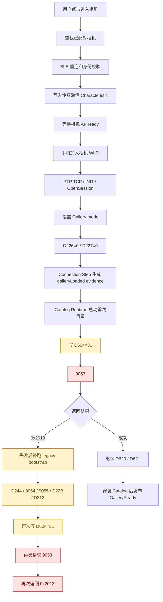
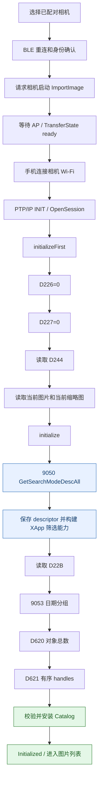
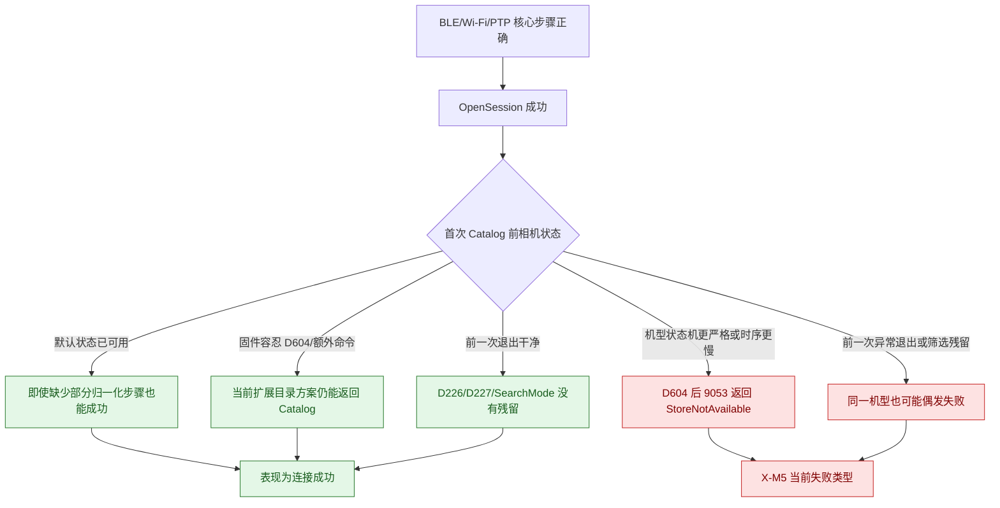
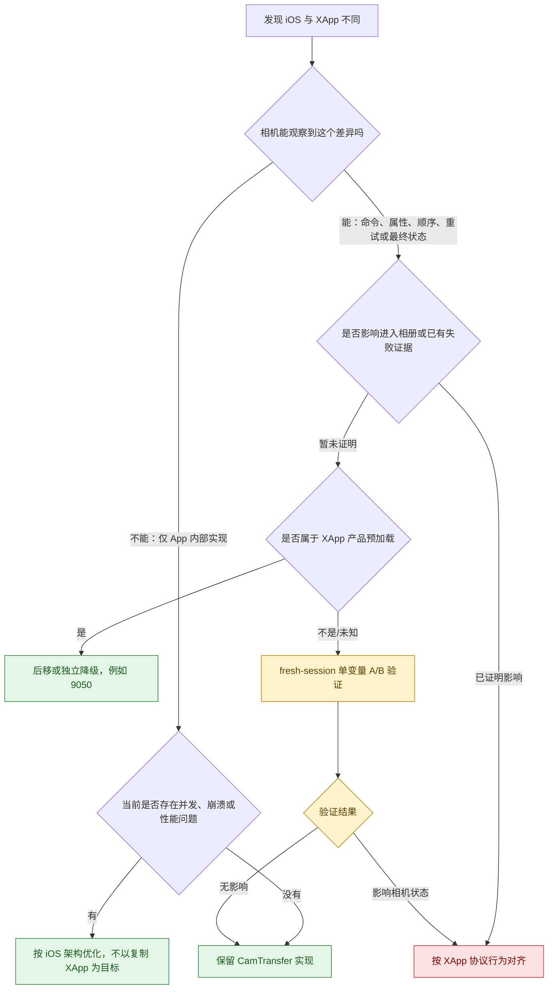
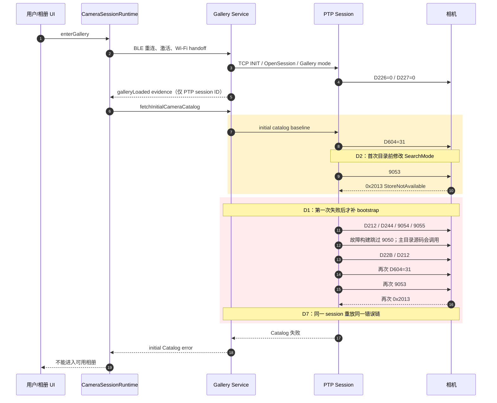
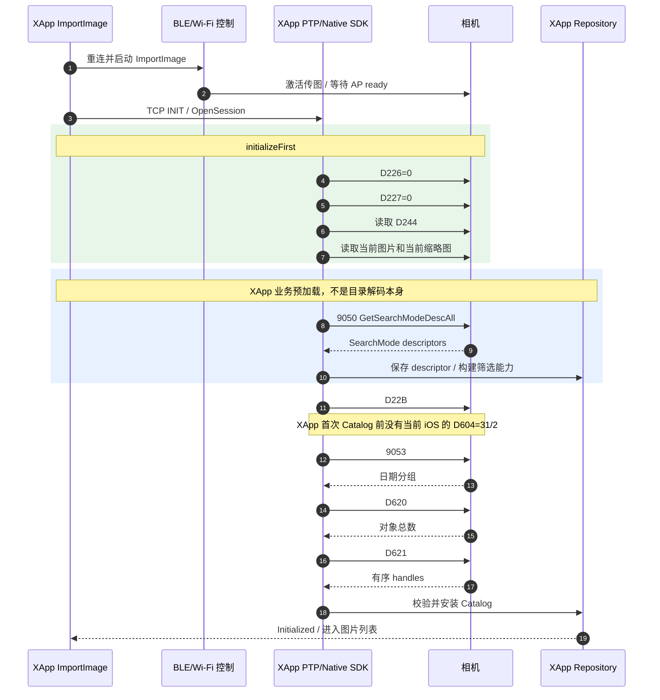
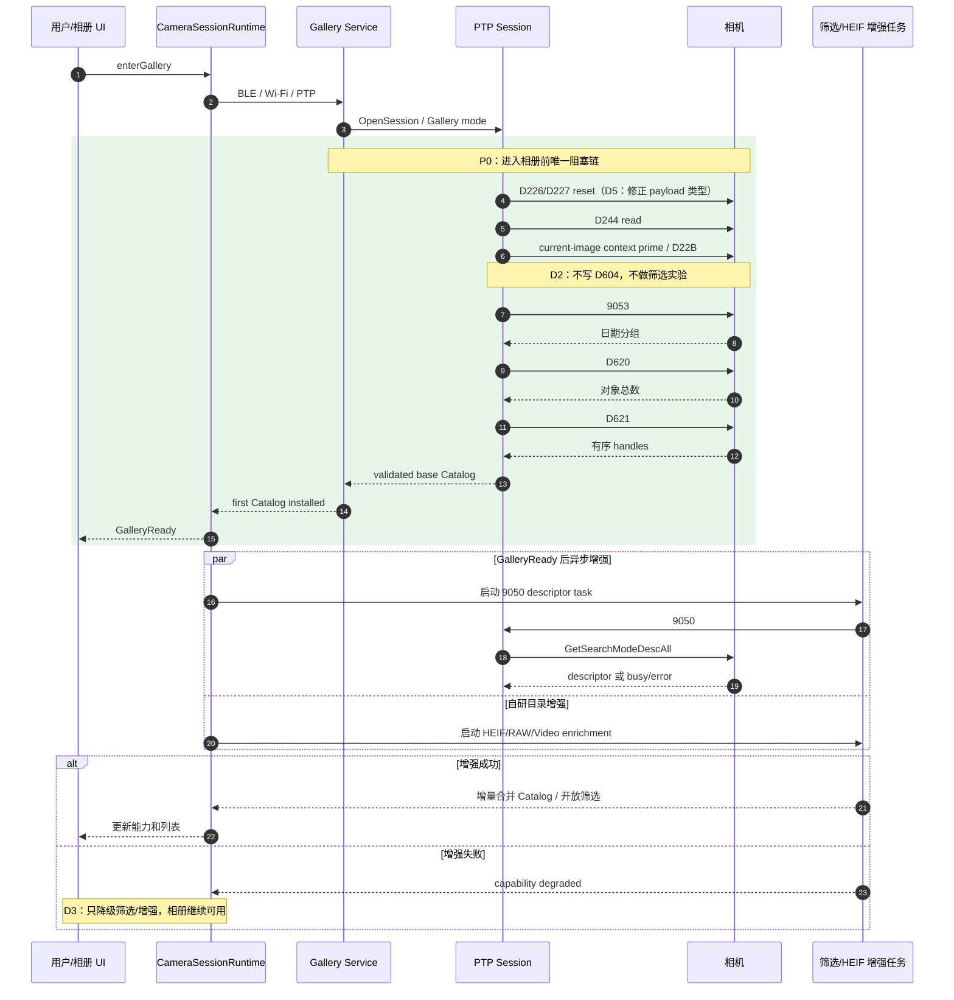
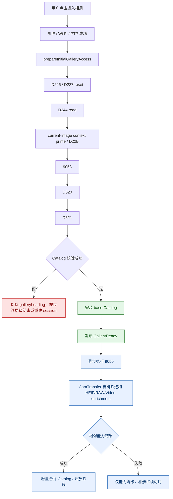

# iOS 与 XApp 进入相册前链路差异审计与落地方案

日期：2026-08-05（补记基于 2026-08-04 审计）
审计分支：`codex/ios-gallery-entry-catalog-refactor`
审计 HEAD：`3e53c3a2`
性质：日志、当前 iOS 源码、XApp 反编译代码与 Git 历史审计；Phase 2 HEIF/视频与 D22B B 方案已完成源码/测试/build，X-T5 已有首次进入与筛选真机证据，跨机型 Gate 未完成。

> 最终执行基线：`docs/ios-gallery-entry-final-solution-20260804.md`
> 首轮 P0 实施计划：`docs/superpowers/plans/2026-08-04-ios-gallery-entry-stabilization.md`
> 本文保留完整证据和差异分析；发生结论冲突时，以最终执行基线为准。

## 0. 本次范围结论

本次改造不要求 CamTransfer 从头到尾复制 XApp。

真正需要解决的是：

> 从用户点击进入相册开始，到首次有效目录安装完成、相册页面可以正常展示为止。

进入相册后的能力继续使用 CamTransfer 自研实现，包括：

- 筛选交互和筛选结果组织。
- 普通缩略图加载。
- HD Preview。
- 原图、压缩图和快速下载。
- 缓存、分页、预取和 UI 投影。
- 下载取消、后台下载和恢复。

因此，XApp 在本文中的作用是：

1. 提供“相机进入可读取目录状态”的协议参考。
2. 帮助识别当前 iOS 在首次目录前改变了哪些相机状态。
3. 不作为进入相册后产品功能和内部架构的复制目标。

### 0.1 对齐终点

本文将“正常进入相册”定义为以下条件全部成立：

```text
BLE 激活成功
-> 相机 AP ready
-> 手机加入相机 Wi-Fi
-> PTP TCP / INIT / OpenSession 成功
-> Gallery mode 初始化完成
-> 首次 9053 成功
-> D620 成功
-> D621 成功
-> 日期组、总数、handle 数量一致
-> 首个 Catalog snapshot 安装完成
-> 用户可见状态进入 GalleryReady
```

到这里为止属于本次 P0。

### 0.2 不再采用的结论

以下旧结论需要废弃：

- “所有相机可见行为从连接、筛选、缩略图到下载都必须复制 XApp。”
- “`9050` 因为 XApp 在初始化中执行，所以一定必须阻塞进入相册。”
- “筛选、缩略图、下载和关闭顺序都是本次 `0x2013` 修复范围。”

正确边界是：

> 只对齐首次目录成功所必需的相机状态和命令顺序；进入相册后的功能允许自研，但必须独立管理相机状态，不能反向污染下一次进入相册。

---

## 第一部分：我们现在进入相册的逻辑

### 1. 当前连接主流程

当前 iOS 从用户点击进入相册到启动首次目录，大致执行：



图中黄色节点是当前与最小入口目标不一致的状态修改或失败后补偿；红色节点是本次日志的直接失败链。

```text
查找已配对相机
-> BLE 重连和身份校验
-> 写入传图激活 Characteristic
   -> CAED ImageTransferSetting
   -> 98934B2C ImageTransferSettingEx
   -> 82A9 ImageResizeSetting
   -> 600655E6 FunctionLaunchRequest
-> 等待相机 AP ready
-> 手机加入相机 Wi-Fi
-> 检查相机 IP / PTP 可达性
-> 建立 PTP TCP
-> INIT Command Request / OpenSession
-> 设置 Gallery mode
-> D226=0 / D227=0
-> Connection Step 生成 galleryLoaded evidence
-> Catalog Runtime 发起首次目录
```

### 2. 当前首次 Catalog

当前首次 Catalog 不是直接读取相机默认目录，而是先执行 HEIF 扩展目录方案：

```text
D604=31
-> 9053
-> D212
-> D620
-> D621

D604=2
-> 9053
-> D212
-> D620
-> D621

clear SearchMode
-> 用两个集合的差异构建扩展 still 格式提示
```

本次 X-M5 日志在第一个 `D604=31 -> 9053` 返回：

```text
0x2013 StoreNotAvailable
```

### 3. 当前失败恢复

第一次 `0x2013` 后，当前实现才补跑 legacy bootstrap：

```text
D212
-> D244
-> 9054 当前图
-> 9055 当前缩略图
-> 故障构建跳过 9050
-> D22B
-> D212
```

然后重新执行同一套 `D604=31 -> 9053` 首次目录，仍返回 `0x2013`。

这里必须区分两个代码状态：

- 本次故障日志和隔离 worktree 明确记录 `PTP_GALLERY_BOOTSTRAP_9050_SKIPPED`。
- 当前主目录源码仍会在 bootstrap 中调用 `requestCameraVendorSearchModeDescAll()`。

这说明 `9050` 当前存在实验分叉，不能把任意一份源码行为直接当成本次日志行为；但跳过 `9050` 后仍失败，已经证明“只删除 `9050`”不能解决问题。

当前代码位置：

- `ios/Runner/CameraVendorPtpSession.swift:563`
- `ios/Runner/CameraVendorPtpSession.swift:602`
- `ios/Runner/CameraVendorPtpSession.swift:890`
- `ios/Runner/CameraVendorRealtimeGalleryService.swift:507`
- `ios/Runner/CameraVendorGalleryMainlineSessionLoader.swift:268`

### 4. 当前 GalleryReady 状态需要区分两层

当前代码存在两个不同语义：

1. Connection Step 的 `galleryLoaded` evidence 只校验了 PTP session ID。
2. `CameraSessionRuntime` 当前已有测试约束：首个 Catalog 未安装前，用户可见 phase 仍是 `galleryLoading`；安装后才进入 `galleryReady`。

因此不能再笼统描述为“当前 UI 一定在 Catalog 前进入 GalleryReady”。更准确的结论是：

> Connection Step 的 evidence 命名和真实完成条件不一致，存在状态误用风险；最终用户可见 GalleryReady 必须继续由首个 Catalog 安装成功控制。

现有约束测试：

- `ios/RunnerTests/RunnerTests.swift:19986`
- `ios/RunnerTests/RunnerTests.swift:19996`

---

## 第二部分：XApp 进入相册前的逻辑

### 1. XApp 主流程

XApp 无线图片导入的入口流程为：



蓝色节点属于 XApp 自己的筛选能力预加载。XApp 将它放在 `Initialized` 前，不代表 CamTransfer 必须用它阻塞首次相册展示。

```text
选择已配对相机
-> BLE 重连和身份确认
-> 请求相机启动 ImportImage
-> 等待 AP / TransferState ready
-> 手机连接相机 Wi-Fi
-> 建立 PTP/IP
-> INIT / OpenSession
-> initializeFirst
-> initialize
-> 首次 Catalog 成功
-> Initialized
```

### 2. XApp initializeFirst

XApp 先执行：

```text
D226=0
-> D227=0
-> 读取 D244
-> 读取当前图片
-> 读取当前缩略图
```

### 3. XApp initialize

随后执行：

```text
9050 GetSearchModeDescAll
-> 保存 descriptor
-> 构建 XApp 自己的筛选能力
-> D22B
-> 9053
-> D620
-> D621
-> Catalog 成功后设置 Initialized
```

主要证据：

- `/tmp/xapp-import-audit.ySFLT5/sources/com/fujifilm/xapp/model/importimage/ImportImageModel.java:660`
- `/tmp/xapp-import-audit.ySFLT5/sources/com/fujifilm/xapp/model/importimage/ImportImageModel.java:1605`
- `/tmp/xapp-import-audit.ySFLT5/sources/com/fujifilm/xapp/model/importimage/ImportImageModel.java:1723`
- `/tmp/xapp-import-audit.ySFLT5/sources/com/fujifilm/xapp/model/importimage/ImportImageModel.java:1949`

### 4. XApp 逻辑不能机械等同于 CamTransfer 的最小入口逻辑

XApp 在 `Initialized` 前完成了自己的筛选能力初始化，所以它把 `9050` 放在首次 Catalog 前。

CamTransfer 的产品边界不同：

- 首屏只需要默认目录。
- 筛选是进入相册后的独立功能。
- 当前首次 Catalog 的数据结构不依赖 `9050` 返回值才能解码 `9053/D620/D621`。

因此：

> `9050` 在 XApp 中有真实业务作用，但现有证据不足以证明它必须阻塞 CamTransfer 进入相册。

本次方案将 `9050` 作为“进入相册后异步初始化筛选能力”，而不是 P0 硬门槛。

唯一例外：如果 fresh session 新日志证明“不执行 `9050` 时首次 `9053` 稳定返回 `0x2013`，执行后稳定成功”，则应将它重新归类为相机协议前置，而不是筛选预加载。

### 5. XApp 连接设计的核心思想

XApp 的设计重点不是“把一串命令全部执行一遍”，而是建立一个有明确完成屏障的分层状态机：


这套设计可以归纳为六条原则：

1. **通道可用不等于业务可用**：BLE、Wi-Fi 和 PTP 成功后，仍要完成 Gallery 初始化和首次 Catalog。
2. **先归一化，再读取**：先清理上次传输残留，再读取当前相机状态，避免依赖“相机刚好处于正确状态”。
3. **初始化是串行事务**：`initializeFirst -> initialize -> Catalog -> Initialized` 有明确顺序，不在中间提前发布可用状态。
4. **相机是有状态设备**：命令不仅返回数据，也可能依赖或改变相机内部状态，因此顺序、最终属性值和重试边界都重要。
5. **Repository 是状态权威**：初始化前清理旧 Repository，成功后一次性安装新能力和 Catalog，避免旧结果混入新 session。
6. **失败关闭而不是带病继续**：XApp 使用 `CommRetry` 区分临时错误和不可持续错误；关键初始化未完成时不会假装已经 Initialized。

### 6. 我们和 XApp 真的是“天壤之别”吗

不是整个连接链都不同。两者的大框架实际上相同：

```text
BLE 身份/激活
-> 相机 AP
-> Wi-Fi
-> PTP OpenSession
-> Gallery mode
-> 读取 Catalog
-> 进入相册
```

真正差异集中在 `OpenSession` 之后、首次 Catalog 之前：

| 维度 | XApp | 当前 iOS | 判断 |
|---|---|---|---|
| 传输层 | BLE/Wi-Fi/PTP | BLE/Wi-Fi/PTP | 基本同构，也是多数机型能够连接的基础 |
| 内部架构 | Repository/coroutine/native worker | Runtime/actor/owner/generation | 可以不同，属于 App 内部实现 |
| 相机状态准备 | 初始化固定前置 | 部分前置，部分在失败后 recovery | 这是主要危险差异 |
| 首次目录 | 默认状态单次读取 | D604 baseline/expanded 两次读取 | 这是本次最直接偏差 |
| Ready 屏障 | Catalog 后 Initialized | Runtime 有 Catalog gate，但中间 evidence 命名偏早 | 应统一语义，不必重写 owner 架构 |
| 失败处理 | 命令级 retry、错误状态、结束初始化 | 补命令后重放整段入口 | 容易累积相机状态并掩盖根因 |

所以更准确的描述是：

> CamTransfer 的传输骨架和 Catalog 核心命令没有偏离 XApp；偏差主要是后续为 HEIF、性能、恢复和并发稳定性增加的逻辑被放进了首次 Catalog 边界，导致相机可观察到的顺序逐步漂移。

### 7. 为什么我们的很多机型仍然能够连接成功

这与“相机是有状态且不同机型容错不同”并不矛盾：



主要原因有五个：

1. **核心通道步骤是正确的**：BLE 激活、AP、Wi-Fi、PTP 和 OpenSession 已经覆盖了连接成功的大部分硬条件。
2. **不是所有 XApp 初始化命令都是硬门槛**：`9050`、当前图预热、D22B 等部分步骤可能是业务预加载或稳定性增强，缺少时不一定立即失败。
3. **相机常常从可用默认状态开始**：正常关机、正常退出或新启动时，SearchMode 和压缩状态可能本来就是可用值，掩盖了归一化步骤缺失。
4. **机型和固件容错不同**：某些机型可能接受首次目录前的 D604 写入，某些机型可能对 Gallery/Storage ready 的顺序更严格。当前只能把它作为待验证解释，不能提前宣称 X-M5 固件一定更严格。
5. **问题需要特定状态组合才触发**：异常退出、重复进入、卡槽状态、媒体数量、格式组合、固件和命令时序共同决定是否暴露问题。

因此，“多数机型能成功”只能证明我们的核心骨架基本正确，不能证明入口状态机已经完整、可重复、跨机型稳定。

### 8. 进入相册前各步骤的作用和关键等级

本文采用四个等级：

- **K0 硬门槛**：缺失时无法建立通道或得到可展示的默认 Catalog。
- **K1 稳定性门槛**：干净 session 可能成功，但缺失会导致异常退出、重复进入或跨机型不稳定。
- **K2 条件步骤**：用于机型、卡槽、当前图或 route 上下文，是否阻塞需按错误类型判断。
- **K3 业务增强**：进入相册后执行即可，不应阻塞 base Catalog。

| 步骤 | 等级 | 作用 | 缺失或错误的影响 | CamTransfer 决策 |
|---|---|---|---|---|
| BLE 身份确认和传图激活 | K0 | 让相机启动 ImportImage/AP 流程 | 相机热点不启动，无法进入 PTP | 保留当前实现，按日志证明继续验收 |
| AP ready / Wi-Fi join | K0 | 建立相机局域网通道 | 无法连接相机 IP | 保留平台实现，不要求照抄 Android 网络 API |
| PTP TCP INIT / OpenSession | K0 | 建立命令 session 和 transaction 空间 | 后续属性和目录命令全部不可用 | 保留当前 PTP owner |
| Gallery mode / ClientState / 版本握手 | K0/K2 | 告诉相机进入图片浏览/导入上下文；具体命令依 route | 模式不对时 Catalog 或对象命令可能不可用 | 标准和 legacy route 分开定义 wire contract |
| D226/D227 reset | K1 | 清理上次压缩/传输模式残留 | 正常首次可能无感，异常退出后可能污染新 session | 每个新 Gallery session 首次 Catalog 前执行，并修正 payload 类型 |
| D244 read | K2 | 获取卡槽/媒体上下文 | 双卡切换或无媒体状态判断错误 | 入口只读；用户主动切卡时才写 |
| 9054/9055 当前图预热 | K2 | 获取当前图片信息和缩略图上下文 | 某些机型/状态可能缺少当前图；X-T5 证据显示 magic handle `0x10000001` 会让首次入口额外阻塞约 22 秒 | 不作为首次 Catalog 硬门槛；入口记录 skipped，GalleryReady 后仍允许媒体链按真实 object handle 请求 |
| 9050 descriptor | K3；协议副作用待证 | 获取 XApp 的筛选能力描述 | 前置失败会把筛选问题扩大成入口失败 | GalleryReady 后异步；仅 fresh-session A/B 证明必要时升级 |
| D22B | K2 | 获取当前对象 handle/锚点 | 当前图定位、增量上下文可能不完整 | 首次目录前读取，但零 handle 或无当前图需按能力降级 |
| 9053 | K0 | 获取按日期分组的对象数量 | 无法建立目录 section | 首次目录核心第一步 |
| D620 | K0 | 获取 specified object 总数 | 无法校验目录规模 | 首次目录核心第二步 |
| D621 | K0 | 获取有序对象 handles | 没有可展示的对象列表 | 首次目录核心第三步，保持相机顺序 |
| Catalog 一致性校验 | K0 | 校验日期组、总数、handles 一致 | 发布半截或错乱目录 | 校验成功后原子安装 snapshot |
| GalleryReady 发布 | K0 | 用户可见的最终入口屏障 | 发布过早会出现空相册、后续任务抢跑 | 只由 first Catalog installed 触发 |
| D212 上下文读取 | K2 | legacy route 状态观察 | 无条件插入会增加时序和归因变量 | 只保留已证明的 legacy handshake，不插入核心三命令之间 |
| D604 / 9051 / 9052 | K3 | 相机筛选和格式目录 | 前置会改变首次目录上下文 | 从入口删除，GalleryReady 后由自研筛选 owner 执行 |

### 9. 最关键的几个步骤

如果只看“用户能否进入一个可用的默认相册”，真正的关键路径是：

```text
传图激活
-> AP ready / Wi-Fi
-> PTP OpenSession
-> Gallery mode
-> 新 session 状态归一化
-> 9053
-> D620
-> D621
-> Catalog 校验和安装
-> GalleryReady
```

其中可以进一步分成三类：

1. **连接硬条件**：传图激活、Wi-Fi、OpenSession、Gallery mode。
2. **目录硬条件**：`9053 -> D620 -> D621` 和一致性校验。
3. **可重复性条件**：D226/D227 reset、旧任务隔离、失败后不继续污染同一 session。

`9050`、D604 筛选、HEIF 扩展、普通缩略图、预览和下载都不属于首次进入默认相册的硬条件。

### 10. XApp 的架构设计一定是最好的吗

不一定。

XApp 有两个不同身份，必须分开评价：

1. **相机协议参考实现**：它由相机厂商维护，对相机状态、命令顺序、错误码和机型兼容具有很高参考价值。
2. **Android 产品和应用架构**：Repository、coroutine、native worker、页面状态和筛选预加载是 XApp 自己的技术选择，不天然适合 iOS，也不一定优于 CamTransfer。

因此不能得出：

```text
XApp 能工作
=> XApp 的所有架构设计都是最优
=> CamTransfer 必须完整复制
```

正确结论是：

```text
相机可观察到的关键协议行为：以 XApp 为高优先级基准
初始化和失败处理原则：吸收 XApp 中已验证的设计思想
App 内部并发、缓存、下载和 UI：根据 iOS/CamTransfer 需求自主设计
```

### 11. 哪些需要对齐，哪些需要优化，哪些直接保留

| 层面 | XApp 的价值 | CamTransfer 当前情况 | 决策 |
|---|---|---|---|
| BLE/AP/PTP 基础协议 | 证明厂商支持的连接路径 | 核心链已能在多机型成功 | 对比并验证，不机械重写 |
| 首次 Catalog 前 wire sequence | 直接影响相机内部状态 | D604、late bootstrap 等发生漂移 | 必须优化并建立 wire contract |
| Catalog 成功后的 Ready 屏障 | 避免半初始化状态对外发布 | Runtime 已有 first Catalog gate，中间 evidence 仍歧义 | 吸收原则，修正状态语义 |
| 初始化错误分类和 retry | XApp 有 CommRetry 和不可持续错误分类 | iOS 更偏整段任务/session retry | 优化成命令、transaction、session 三层策略 |
| Repository/Runtime owner | XApp 使用 Repository/coroutine | iOS 使用 Runtime/actor/owner/generation | 保留 iOS 架构，不复制 XApp 类结构 |
| 9050 筛选预加载 | 满足 XApp 在 Initialized 前准备筛选的产品需求 | CamTransfer 首屏不依赖筛选 descriptor | 不复制前置边界，GalleryReady 后异步 |
| 缩略图、预览和下载 | XApp native worker 是一种实现 | CamTransfer 有独立缓存、owner、generation 和流式文件路径 | 不属于本次入口改造，按独立性能和稳定性证据评估 |
| UI、分页、缓存、快速下载 | XApp 产品逻辑 | CamTransfer 自研产品能力 | 继续自研，不要求 parity |

### 12. 面对一个差异时的决策方法



这个决策框架避免两个极端：

- 极端一：认为 XApp 所有代码都是最佳实践，全部照抄。
- 极端二：因为 CamTransfer 多数机型能用，就忽略所有协议顺序差异。

#### 12.1 改造准入原则：先说明目的，再允许改代码

发现差异不等于必须改造。任何生产改动开始前，必须回答以下问题：

1. **当前具体问题是什么**：必须有日志、源码、测试、真机现象或明确状态风险，不能只说“和 XApp 不一样”。
2. **当前设计当初解决什么问题**：必须找到 Git 历史、设计文档、代码注释或至少给出证据等级明确的推断。
3. **当初的原因现在是否仍然成立**：如果历史诉求仍存在，不能直接删除，只能移动边界、拆分职责或提供替代方案。
4. **本次改造的唯一目的是什么**：一句话说明要改变的结果，不能用“对齐 XApp”代替业务和技术目的。
5. **本次明确不解决什么**：防止入口修复顺带扩展到筛选、缩略图、下载或无关重构。
6. **最小改动是什么**：只改变能够解决问题的最小相机可见行为，不重写无关内部架构。
7. **可能引入什么新风险**：必须说明对 HEIF、筛选、重连、双卡、后台和后续任务的影响。
8. **怎么证明达到目的**：必须有 wire contract、状态机测试、故障注入和真机日志验收。
9. **如果假设错误怎么办**：需要 feature flag、实验分支、单变量回退或明确的 session 重建策略。

如果上述问题不能回答，正确动作是继续调查或设计 fresh-session A/B 实验，而不是直接修改生产代码。

#### 12.2 每个改造项必须使用的意图模板

```text
改造 ID：
现象和证据：
当前实现：
历史设计目的：
历史目的是否仍成立：
本次改造目的：
明确非目标：
最小实现变化：
保留的现有能力：
风险和影响面：
验收标准：
假设失败后的处理：
```

实现计划、代码评审和最终验收必须使用同一个改造 ID，避免设计目的在编码过程中丢失。

#### 12.3 本次候选改造的目的清单

| 改造 ID | 现象和证据 | 历史设计目的 | 本次改造目的 | 明确非目标 | 最小变化 | 风险与验收 |
|---|---|---|---|---|---|---|
| M1 前移 pre-catalog prepare | 首次 `9053` 失败后才补 bootstrap，补完后仍重放错误链 | 将 bootstrap 作为 `0x2013` recovery，尽量不增加正常入口耗时 | 确保第一次目录请求发生前，相机已完成必要状态准备 | 不是为了逐条复制 XApp initializeFirst | 将已有 reset、卡槽读取和上下文准备收口到首次 `9053` 前；按错误类型决定是否阻塞 | 风险是可选 prime 被误设为硬门槛；验收为 `PREPARE_END` 早于首次 `9053`，且无 failure-only bootstrap |
| M2 从入口移除 D604 | 本次直接在 `D604=31` 后的 `9053` 返回 `0x2013`；XApp 首次目录未发现该写入 | 解决默认目录漏 HEIF，并避免全量 ObjectInfo 性能问题 | 让首次目录在最小、未被筛选修改的相机状态中执行 | 不是放弃 HEIF、RAW、Video 支持 | 仅将 D604/count sweep/subtract-baseline 移到 GalleryReady 后 enrichment | 风险是首屏 HEIF 不完整；验收为首次 `9053` 前无 D604，后置 enrichment 可增量补齐 |
| M3 首次目录改成单次 base Catalog | 当前 baseline 和 expanded 读取两次目录并做集合差 | 同时完成首屏加载和格式发现 | 建立最小、原子、容易验证的首个 Catalog snapshot | 不是删除后续格式分类 | 入口只执行一次 `9053 -> D620 -> D621` 和一致性校验 | 风险是 base Catalog 能力较少；验收为一次三命令成功即可 GalleryReady，增强失败不清空列表 |
| M4 9050 后移 | XApp 用它构建筛选能力；故障构建跳过后仍然 `0x2013` | 在 XApp Initialized 前准备完整筛选 UI；iOS 早期直接移植 | 避免筛选 descriptor 的 busy/失败扩大成无法进入相册 | 不是认定 9050 无协议作用，也不是删除命令 | 所有入口路径统一为 GalleryReady 后异步执行；保留 fresh-session A/B 开关 | 风险是筛选稍晚可用；验收为 9050 失败时相册仍可用，若 A/B 证明其是协议前置则重新评审 M4 |
| M5 统一 GalleryReady 语义 | Connection Step 只有 PTP session ID 就生成 `galleryLoaded` evidence；Runtime 实际等待 Catalog | 单 Catalog owner 重构后，希望 loader 不再拥有目录 | 让所有调用方对“可进入相册”的理解只有一个：first Catalog installed | 不是把 Catalog 重新塞回 loader，也不是破坏单 owner | 重命名中间 evidence，最终 GalleryReady 仍由 Runtime/Catalog owner 发布 | 风险是状态迁移调用方遗漏；验收为 Catalog 未安装时所有 UI/任务保持 galleryLoading |
| M6 重构 `0x2013` recovery | 同一 session 中补命令后再次执行相同 D604 入口链并重复失败 | 希望不重连就恢复临时 StoreNotAvailable | 防止在未知相机状态上继续叠加命令，并让失败变量可归因 | 不是删除所有 retry | temporary/busy 使用幂等命令级 retry；`0x2013` 结束当前 Catalog，必要时重建 PTP session | 风险是重建成本增加；验收为同一 session 不再出现两次完全相同失败链，日志保留 retry origin |
| M7 核实并统一 D227 payload | reset 和下载路径使用的 payload 宽度不一致 | 异常退出后清理压缩状态 | 确保发送给相机的属性类型和 wire bytes 正确 | 不是因为 XApp 写 0 就直接猜成 UInt16 | 先取 native/descriptor/成功 payload 证据；证据确定前不改生产编码 | 风险是错误改宽度导致更多机型失败；验收为类型证据、exact-wire-byte 测试和真机回读一致 |
| M8 核实 D212 插入边界 | iOS 在 `9053` 与 `D620` 间读取 D212；XApp Java 初始化未发现，本次读取后也未恢复 | 早期按抓包上下文移植，可能服务 legacy route | 减少核心目录 transaction 中未经证明的状态变量 | 不是删除所有 legacy D212 | 先建立 route 级 wire contract；只从核心三命令之间移除未证明的 D212 | 风险是某 legacy 机型依赖；验收为标准/legacy 分别测试，核心三命令连续且旧机型仍可进入 |
| M9 两阶段 Catalog | 当前入口同时承担连接、格式发现和筛选准备 | 希望用户首次进入就得到完整格式能力 | 将“能进入相册”和“获得完整增强能力”拆成两个独立成功条件 | 不是减少最终产品功能 | base Catalog 成功立即 GalleryReady；后置任务增量合并能力和对象 | 风险是 UI 短暂处于能力加载中；验收为清晰 loading/ready/degraded 状态且列表不闪烁 |
| M10 保留 iOS owner 架构 | iOS 与 XApp 内部类、线程和任务模型不同 | 解决并发、后台、旧任务回写和崩溃问题 | 防止协议修复演变成无必要的全架构重写 | 不是要求与 XApp 内部实现一致 | 只调整 session owner 发出的相机可见命令和状态屏障 | 风险是旧路径绕过新 contract；验收为单 session、单 Catalog owner、generation fence 测试保持通过 |

#### 12.4 改造项的状态不是全部相同

| 状态 | 改造项 | 含义 |
|---|---|---|
| 已有充分问题证据，可进入详细设计 | M1、M2、M3、M5、M6、M9、M10 | 可以编写逐文件实施计划和测试，但仍需用户确认设计 |
| 方向明确，但必须保留实验回退 | M4 | 9050 后移符合产品边界，但隐藏协议副作用尚未完全排除 |
| 必须先补证据，不能直接改生产代码 | M7、M8 | D227 类型和 D212 route 依赖尚未达到直接修改的证据强度 |

这个状态表必须随新日志和实验更新，不能把“候选方案”写成“已经证明的修复”。

### 13. 本次到底需要优化什么

#### 必须优化的 P0

- 首次 Catalog 前的相机状态准备边界。
- 删除入口 D604 筛选实验。
- 首次目录恢复成单次 `9053 -> D620 -> D621`。
- 首个 Catalog 安装后才发布 GalleryReady。
- `0x2013` 不再在同一 session 中重放同一错误链。
- D227 payload 类型需要另行补证据，但明确不属于本次 Initial Catalog P0。

#### 应吸收但不照抄的 P1

- XApp“先归一化、再读取”的初始化原则。
- 临时错误、不可持续错误和 terminal transport failure 的分层处理。
- 初始化 transaction 的取消、错误状态和最终完成屏障。
- fresh session 的可重复进入验证。

#### 应直接保留的 CamTransfer 设计

- 单 `CameraSessionRuntime` owner。
- 单 Catalog owner。
- Actor 和 CommandLane 串行化。
- Session/generation/snapshot identity fence。
- stale result 防回写。
- 后台下载和临时文件流式写入。
- 自研筛选、缩略图、预览、下载和快速下载产品逻辑。

### 14. 结论：不能只对比，也不能完整复制

只做文档对比而不改造，无法解决已经确认的入口协议偏差。

完整复制 XApp，又会破坏 CamTransfer 已经建立的 iOS owner、并发、后台和产品能力。

正确方案是：

> 先用 XApp 找到相机协议的正确边界，再对 CamTransfer 做最小、证据驱动的入口优化；相机看得见的关键行为对齐，相机看不见的内部架构继续使用更适合 iOS 的自研设计。

---

## 第三部分：进入相册前的差异及产生原因

### 0. 一页看懂三条时序

#### 0.1 当前 iOS：先改 SearchMode，失败后才补初始化



当前链的关键问题不是 BLE 或 PTP 没连上，而是：

1. `D2`：首次 `9053` 前先写 `D604=31`。
2. `D1`：完整 bootstrap 被放到第一次失败以后。
3. `D7`：恢复后再次执行相同的 D604 目录链，所以相同失败被重复。

#### 0.2 XApp：先完成初始化，再读取一次默认目录



XApp 与当前 iOS 最核心的顺序区别是：

```text
XApp：初始化完成 -> 直接 9053/D620/D621
iOS：先 D604=31 -> 9053 失败 -> 再补初始化 -> 再次 D604=31/9053
```

#### 0.3 目标 CamTransfer：最小入口成功后，再启动自研增强



目标流程不是完整复制 XApp，而是：

1. 进入相册前，只保留首次目录成功必需的协议步骤。
2. `GalleryReady` 以首个有效 Catalog 安装完成为准。
3. `9050`、筛选和 HEIF 扩展全部后移，失败不再等于连接失败。

### 1. 差异总表

| 编号 | 当前 iOS 与 XApp 的区别 | 为什么产生 | 可能影响 | 怎么改造 | 验收标准 |
|---|---|---|---|---|---|
| D1 Bootstrap 时机 | iOS 第一次 `9053` 失败后才补；XApp 首次 Catalog 前完成 | 将初始化追加成 `0x2013` recovery | 首个目录请求发生在相机状态未完整准备时 | 每个新 Gallery session 在首次 `9053` 前执行一次 `prepareInitialGalleryAccess` | 日志中 `GALLERY_PREPARE_END` 必须早于首次 `9053` |
| D2 首次 SearchMode | iOS 先写 `D604=31/2`；XApp 默认状态直接读首次目录 | 为解决 HEIF 漏图和 ObjectInfo 性能复用筛选实验 | 改变相机目录上下文；本次直接在后续 `9053` 返回 `0x2013` | 入口链删除所有 D604、count sweep 和 subtract-baseline | 首次 `9053` 前 wire log 中不存在 `9051/9052/D604` payload |
| D3 `9050` 边界 | 主目录源码前置；故障构建跳过；XApp 前置并用于筛选能力 | XApp 业务初始化被直接搬到入口，之后又为 busy 做跳过实验 | 前置会让筛选能力失败阻塞入口；跳过实验又无法单独证明协议副作用 | GalleryReady 后异步执行，只有 fresh-session A/B 证明必要时才重新前置 | `9050` busy/失败时 base Catalog 和 GalleryReady 保持可用 |
| D4 D212 插入位置 | iOS 在目录过程中额外读取；XApp Java 初始化未发现 | 早期抓包式移植，缺少原始设计记录 | 增加时序和未知状态读取，干扰故障归因 | 从 `9053 -> D620 -> D621` 中移除，只保留已证明的 legacy handshake | 首次目录 wire sequence 三条命令连续，期间没有 D212 |
| D5 D227 payload | iOS reset 与下载路径的写入宽度不一致；XApp/native 类型固定 | 早期属性类型移植不完整 | 可能导致属性写入未生效或相机解析异常 | 用 native、GetDevicePropDesc 或成功 payload 确认类型并统一编码 | exact-wire-byte 测试和真机回读均一致 |
| D6 Ready 语义 | Connection Step 仅有 session ID 就生成 `galleryLoaded` evidence；XApp Catalog 成功后才 Initialized | 单 Catalog owner 重构后 evidence 名称未同步 | 日志、状态机或调用方可能把 PTP 成功误判成相册可用 | 拆成 `ptpSessionOpened -> galleryModePrepared -> firstCatalogInstalled -> galleryReady` | 首个 Catalog 未安装时 UI 永远保持 `galleryLoading` |
| D7 Recovery 策略 | iOS 失败后补命令并在同 session 重放同一 D604 链；XApp 使用命令级有限 retry/错误状态 | 针对单次错误不断叠加补丁 | 相机状态继续累积，重复失败且难以定位变量 | 幂等 temporary/busy 仅命令级 retry；`0x2013` 结束 Catalog，必要时重建 PTP session | 同一 session 不得出现两次完全相同的失败入口链 |
| D8 首次目录次数 | iOS 为 baseline/expanded 读取两次目录；XApp 读取一次默认目录 | 入口同时承担格式发现和首屏加载 | 延长进入时间，并让 HEIF 功能绑死入口稳定性 | 先安装一次 base Catalog；GalleryReady 后再 enrichment | 首屏只需一次 `9053/D620/D621`，增强失败不清空首屏 |
| D9 卡槽处理 | iOS 定义 setter 但生产入口不调用；XApp 初始化只读，用户切卡才写 | 为 X-T5 双卡预留能力 | 若误写可能影响单卡机型；当前日志没有误写证据 | 入口只读 D244，不主动切卡 | X-M5 日志无 D244 set；X-T5 双卡分别验证当前槽 |
| D10 内部 owner | iOS 使用 Runtime/Catalog owner、actor、generation；XApp 使用 Repository/native worker | iOS 为并发、后台和崩溃安全自研 | 内部实现不同本身无负面影响，机械照抄反而会破坏现有稳定性 | 保留 iOS owner 架构，只调整相机可观察到的入口 wire sequence | 单 session、单 Catalog owner、旧 generation 不回写新相册 |

### 2. 差异为什么会产生

#### 2.1 异常退出后相机状态残留

提交 `24fb9964` 增加 `D226/D227` reset，目的是处理：

- App 崩溃。
- 用户强杀。
- 下载中断。
- 相机仍停留在强制压缩或传输状态。

这个设计理由仍然成立，不能删除；需要修正的是执行边界和 payload 类型。

#### 2.2 HEIF 漏图和全量 ObjectInfo 太慢

提交 `331b6436` 和 `c1703647` 引入：

- `D604=31` baseline。
- `D604=2` 扩展目录。
- subtract-baseline。
- 格式提示推导。

当初要解决的问题是真实的：

- 默认目录可能漏 HEIF。
- 全量读取 ObjectInfo 成本过高。
- 希望首屏快速得到格式分类。

但它被放进首次 Catalog 后，产生了新的风险：

> 用户还没进入相册，就先修改相机 SearchMode；如果该机型此时尚未完成 Gallery/Storage 初始化，第一次 9053 就可能失败。

历史诉求应保留，但实现位置必须移动到 GalleryReady 之后。

#### 2.3 单 Catalog owner 重构

提交 `4e81e66e` 将 Catalog 生命周期收口到单 owner，避免 loader 和 runtime 同时读取目录。

这个架构方向正确，应该保留。

问题是 Connection Step 仍使用 `galleryLoaded` 命名，而真正的用户可用状态由 Catalog Runtime 决定，导致审计和日志容易误判。

#### 2.4 9050 存在前置与跳过两套实验路径

XApp 在初始化期间读取 descriptor，是因为 XApp 要在自己的 `Initialized` 状态前准备筛选能力。当前主目录源码仍前置调用，故障构建和隔离 worktree 则已经跳过。

CamTransfer 进入相册只依赖默认目录时，没有必要把“筛选能力准备失败”升级成“不能进入相册”。

这不是说 `9050` 无作用，而是重新定义失败边界：

- `9050` 成功：筛选能力可用。
- `9050` busy/失败：相册仍可用，筛选显示加载中、重试或降级。
- 只有证明 `9050` 会改变首次目录可用状态，才重新前置。

#### 2.5 D212 和早期协议移植

部分 D212 读取从早期实现就存在，未找到明确原始设计讨论。

当前证据只能说明：

- legacy route 的握手可能需要读取上下文。
- 在 `9053` 和 `D620` 中间插入 D212 没有 XApp Java 初始化证据。
- 本次日志中多次 D212 也没有解除 `0x2013`。

因此不能继续把它当作无条件目录步骤。

---

## 第四部分：本次失败到底定位到哪里

### 1. 已排除

日志已经证明以下环节成功：

- BLE 配对和重连。
- 相机传图模式激活。
- 相机 AP 启动。
- 手机加入相机 Wi-Fi。
- PTP TCP 连接。
- INIT / OpenSession。

因此本次不是“配对连接不上”，也不是“网络没连上”。

### 2. 单卡/双卡不是当前根因

日志中的：

```text
D244=00
```

表示当前卡槽/双卡状态值为零，不等于无卡。

当前生产链也没有主动调用 D244 setter 去切换卡槽，所以没有证据支持“按 X-T5 双卡逻辑错误切换了 X-M5 单卡”。

### 3. 直接失败点

首次目录请求：

```text
D604=31
-> 9053
-> 0x2013 StoreNotAvailable
```

关键日志：

- `/Users/g01d-01-1224/Desktop/传图/日志/CamTransfer-Diagnostics-2026-08-03T13-45-44Z.log:6363`
- `/Users/g01d-01-1224/Desktop/传图/日志/CamTransfer-Diagnostics-2026-08-03T13-45-44Z.log:6489`
- `/Users/g01d-01-1224/Desktop/传图/日志/CamTransfer-Diagnostics-2026-08-03T13-45-44Z.log:6948`
- `/Users/g01d-01-1224/Desktop/传图/日志/CamTransfer-Diagnostics-2026-08-03T13-45-44Z.log:7072`

### 4. 当前最可信的故障边界

能够确认的是：

> 相机已经可以通信，但首次目录前的状态准备和请求顺序存在偏差；iOS 在首次 9053 前写入 D604=31，是当前最直接、最应该先移除的非 XApp 行为。

还不能确认的是：

- 相机内部为何把该状态映射成 `StoreNotAvailable`。
- current-image prime、D22B、9050 中哪一个是否具有隐藏协议副作用。
- X-M5 固件是否还有 Java 反编译层不可见的 native 初始化。

所以本次修复目标不是宣称已经解释相机内部实现，而是先恢复一个干净、最小、可重复验证的入口链。

---

## 第五部分：落地技术方案

### 1. 目标架构：两阶段目录



目标流程的硬边界是绿色的 `GalleryReady`；蓝色部分全部属于进入相册后的自研增强能力，失败不能反向破坏已经安装的 base Catalog。

### 阶段 A：最小入口目录

只负责让用户进入相册：

```text
BLE/Wi-Fi/PTP 成功
-> Gallery session 初始化
-> D226/D227 reset
-> D244 read
-> current-image/current-thumbnail context prime（按能力分类错误）
-> D22B snapshot
-> 9053
-> D620
-> D621
-> 校验并安装 base Catalog
-> GalleryReady
```

阶段 A 禁止执行：

```text
9050 阻塞等待
D604=31
D604=2
count sweep
subtract-baseline
格式筛选
全量 ObjectInfo
```

### 阶段 B：进入相册后的能力增强

GalleryReady 后异步执行：

```text
9050 获取 SearchMode descriptor
-> 生成筛选能力
-> 需要时执行 CamTransfer 自研筛选
-> 后台补充 HEIF/RAW/Video 分类或扩展目录
-> 增量合并到当前 Catalog
```

阶段 B 失败不能把已经可用的相册退回连接失败。

### 2. 入口链具体改造

#### 2.1 建立唯一的 pre-catalog prepare

在 `CameraVendorPtpSession` 中收口一个明确入口，例如：

```text
prepareInitialGalleryAccess()
```

职责只包括：

- reset 相机上一次传输残留状态。
- 读取卡槽状态。
- 按机型能力执行 current-image/current-thumbnail prime。
- 读取 D22B snapshot。
- 记录每一步 response code 和耗时。

它必须在首次 `9053` 前执行一次，不能等 `0x2013` 后才补跑。

#### 2.2 首次 Catalog 改为默认目录单次读取

将 `cameraVendorInitialCatalogSnapshot()` 的入口路径改为：

```text
9053
-> D620
-> D621
-> validate
-> publish
```

删除入口路径中的：

- D604 baseline。
- HEIF D604 probe。
- SearchMode clear。
- subtract-baseline format hints。

原有扩展能力移动到 GalleryReady 后的独立 enrichment API。

#### 2.3 9050 后移

将 `requestCameraVendorSearchModeDescAll()` 从 blocking bootstrap 移到 GalleryReady 后：

- 使用独立 task/owner。
- 允许有限 busy retry。
- 失败只影响筛选能力状态。
- 不能取消或替换已经安装的 base Catalog。
- 重新连接时按 session identity 清理旧 descriptor。

#### 2.4 D227 类型保持不动，另行补证据

不能仅凭当前代码猜测两字节或四字节。

实现时按以下优先级确定：

1. XApp native/反汇编中的属性类型。
2. GetDevicePropDesc 返回的数据类型。
3. 同机型成功日志中的 payload。
4. 最后才是现有 Swift 调用的一致性推断。

证据确定后再用独立计划统一 reset 和下载路径，并增加 exact-wire-byte 测试；本次 P0 不修改生产编码。

#### 2.5 删除 0x2013 同链重放

当前逻辑：

```text
错误入口链
-> 0x2013
-> 补 bootstrap
-> 再执行相同错误入口链
```

应改为：

```text
prepare 前置
-> 最小目录请求
-> temporary/busy：仅幂等命令有限重试
-> 0x2013：记录完整前置状态并结束本次 Catalog
-> 必要时重建整个 PTP session，不在同 session 中继续叠加 D604/recovery 状态
```

#### 2.6 统一 Ready 语义

保留当前 `CameraSessionRuntime` 的首个 Catalog gate。

建议将 Connection Step 的证据拆成：

```text
ptpSessionOpened
galleryModePrepared
catalogRuntimeStarted
firstCatalogInstalled
galleryReady
```

至少不能继续把“只有 PTP session ID”命名成完整 `galleryLoaded`。

### 3. 预计修改文件

| 文件 | 改造内容 |
|---|---|
| `ios/Runner/CameraVendorPtpSession.swift` | 收口 pre-catalog prepare；首次目录移除 D604；D227 wire 类型保持不动 |
| `ios/Runner/CameraVendorRealtimeGalleryService.swift` | 首次 Catalog 不再 0x2013 后补 bootstrap；增加 post-ready descriptor/enrichment API |
| `ios/Runner/CameraVendorGalleryMainlineSessionLoader.swift` | 修正 connection evidence 命名和职责，不把 PTP session 当成完整 loaded |
| `ios/Runner/CameraSessionRuntime.swift` | 保留 first Catalog gate；启动 post-ready enrichment；确保失败不降级相册主状态 |
| `ios/Runner/CameraVendorCatalogPolicy.swift` | 将 HEIF 扩展和 subtract-baseline 从 initial policy 拆成 enrichment policy |
| `ios/RunnerTests/RunnerTests.swift` | 增加 wire order、禁止命令、状态门禁、失败隔离和重复进入测试 |

### 4. 推荐实施顺序

#### P0-1：先固定入口 wire contract

增加测试，明确首次 Catalog 前允许和禁止的命令：

```text
允许：reset / card state / context prime / D22B / 9053 / D620 / D621
禁止：D604 / 9050 blocking / count sweep / subtract-baseline
```

#### P0-2：前移 prepare，删除 failure-only bootstrap

让每个新 Gallery session 在首次目录前准备一次。

#### P0-3：首次目录改为单次默认目录

先保证 X-M5、X-T5 都能得到一致的 base Catalog 并进入相册。

#### P0-4：校正 Ready evidence

保持“首个 Catalog 安装后才 GalleryReady”，并消除中间 evidence 的歧义。

#### P1：9050 和扩展目录后移

相册可用后再加载筛选 descriptor 和 HEIF/RAW/Video 增强能力。

#### P1：删除废弃入口路径

新入口稳定后，删除：

- 入口 D604 baseline。
- 入口 D604=2 probe。
- `recoverInitialCameraCatalogAfterStoreNotAvailable()` 这种失败后补 bootstrap 的路径。
- 只为旧入口存在的重复日志和策略分支。

---

## 第六部分：是否会影响后续功能

### 1. 可能的正面影响

- 首次进入相册更快，减少两次目录和 SearchMode 写入。
- 首屏失败边界更清楚，不再被筛选、HEIF 增强拖死。
- X-M5 与 X-T5 的入口差异更容易比较。
- 后续筛选失败不会被误报成连接失败。

### 2. 需要处理的兼容风险

#### 2.1 首屏 HEIF 可能不是完整集合

移除 D604 扩展目录后，base Catalog 可能只包含相机默认暴露的对象。

处理方式：

- 先显示 base Catalog。
- GalleryReady 后运行扩展目录/enrichment。
- 通过 snapshot identity 增量合并，不能清空或闪烁已有列表。

#### 2.2 筛选按钮不能假设 descriptor 已经存在

进入相册后 `9050` 可能仍在执行。

UI 应明确三态：

```text
loading
ready
unavailable/retryable
```

不能因为 descriptor 未完成而阻塞整个相册。

#### 2.3 快速下载不能依赖扩展 format hints 已同步完成

如果快速下载选择逻辑依赖 HEIF/RAW format hints，需要：

- 等待对应对象的 ObjectInfo。
- 或等待 enrichment 完成。
- 不能再假设 initial Catalog 已经包含 subtract-baseline 结果。

#### 2.4 下一次进入相册必须清理后置任务

虽然筛选和扩展目录是进入相册后的自研功能，但它们仍会修改相机 SearchMode。

退出、断连或新 session 开始前必须：

- 取消旧 enrichment task。
- 阻止旧 generation 回写。
- 确保下一次入口不继承旧 SearchMode transaction 的半完成状态。

这属于“保证下次能进入相册”的边界，仍是本方案必须覆盖的内容。

### 3. 不需要为本次方案改造的能力

以下能力不因本次入口修复而要求按 XApp 重写：

- 普通缩略图协议和缓存策略。
- HD Preview。
- 原图或压缩图下载。
- 快速下载产品逻辑。
- 下载中心、进度和失败重试 UI。
- generation/snapshot/session fence。
- Actor、CommandLane 和 owner 架构。
- terminal transport loss 处理。
- 临时文件流式写入。

只有当这些能力会在 GalleryReady 前启动，或会留下状态影响下一次入口时，才需要纳入入口改造。

---

## 第七部分：如何保证实现彻底

### 1. 静态 wire contract 测试

必须断言首次 Catalog 的命令顺序：

```text
prepareInitialGalleryAccess
-> 9053
-> D620
-> D621
```

并断言首次 `9053` 前不存在：

```text
9050 blocking
9051
9052
D604 payload
count sweep
subtract-baseline
```

### 2. 状态机测试

必须覆盖：

- PTP 成功但 Catalog 未成功时仍是 `galleryLoading`。
- Catalog 安装后才是 `galleryReady`。
- 9050 失败不影响已进入的 GalleryReady。
- enrichment 失败不清空 base Catalog。
- 旧 session 的后置任务不能回写新 session。

### 3. 故障注入

至少注入：

- D226 reset busy。
- D244 read failure。
- current-image 不存在。
- 9053 返回 busy。
- 9053 返回 `0x2013`。
- D620 与 D621 数量不一致。
- 9050 post-ready busy/失败。
- enrichment 中途断连。

每个错误必须有明确结果：当前命令 retry、Catalog 失败、session 重建、或仅能力降级。

### 4. 日志验收

新增一条稳定入口 trace：

```text
GALLERY_ENTRY_SESSION_BEGIN
GALLERY_PREPARE_BEGIN/END
GALLERY_INITIAL_CATALOG_9053
GALLERY_INITIAL_CATALOG_D620
GALLERY_INITIAL_CATALOG_D621
GALLERY_INITIAL_CATALOG_VALIDATED
GALLERY_FIRST_SNAPSHOT_INSTALLED
GALLERY_READY_PUBLISHED
GALLERY_POST_READY_9050_BEGIN/END
```

每条记录必须带：

- camera model。
- firmware（可得时）。
- session ID。
- generation。
- response code。
- duration。

### 5. 真机矩阵

最低验收：

| 机型 | 场景 |
|---|---|
| X-M5 单卡 | 首次配对后进入、已配对重连、退出后再次进入 |
| X-T5 单卡 | 进入、退出、再次进入 |
| X-T5 双卡 | 当前卡槽 A/B 分别进入；不主动切卡 |

每个场景至少验证：

1. 首次 9053 成功。
2. D620/D621 一致。
3. 首个 snapshot 安装后才 GalleryReady。
4. 9050 后置失败不会退出相册。
5. 再次进入不继承上次 SearchMode 残留。

### 6. 完成判定

只有同时满足以下条件，才能说入口改造完成：

- 生产入口不存在 D604 初始筛选。
- failure-only bootstrap 已删除。
- 9050 不再阻塞入口。
- 首次目录只有一套 owner 和一套 wire sequence。
- Runtime 的 GalleryReady 只由已安装 Catalog 触发。
- X-M5 和 X-T5 真机日志通过。
- 旧入口代码和测试已删除，而不是仅增加新分支后继续共存。

---

## 第八部分：优化后能不能解决当前问题

现在仍不能在没有新真机日志的情况下承诺 100% 解决。

但本方案比“完整复制 XApp 所有功能”更准确，因为它直接处理当前已证明的失败边界：

1. 连接和 OpenSession 已成功。
2. 第一个失败点是首次 9053。
3. 失败前存在非 XApp 的 D604=31 状态写入。
4. 当前 recovery 仍重放同一套入口目录。
5. 9050 是否执行不是现有日志能单独证明的变量。

因此第一轮改造应验证：

```text
正确 pre-catalog prepare
-> 不写 D604
-> 不让 9050 阻塞
-> 直接 9053/D620/D621
```

如果该链在 X-M5 成功，当前问题即被解决，同时不会强迫后续自研功能复制 XApp。

如果仍然返回 `0x2013`，下一轮才按单变量继续验证：

1. 将 9050 临时前置，判断是否存在隐藏协议副作用。
2. 对比 XApp BLE 激活后的额外状态。
3. 检查 X-M5 特有 ClientState/ImageHost/native 初始化。
4. 比较 AP ready 后 BLE 保持/断开策略。

不能再通过同时增加多个 recovery 命令判断原因。

---

## 最终结论

1. 本次只改“进入相册前”的链路，不重写进入相册后的自研功能。
2. 当前失败不是配对、Wi-Fi、PTP 或单双卡问题。
3. 当前最直接的入口偏差是首次 9053 前写入 D604=31，并在失败后重放同一目录方案。
4. `9050` 有真实筛选作用，但当前不应阻塞进入相册；应后移并独立降级。
5. 首次目录应恢复成最小、单次、可验证的 `9053 -> D620 -> D621`。
6. GalleryReady 必须以首个有效 Catalog 安装成功为准。
7. HEIF、筛选、缩略图、预览和下载继续使用 CamTransfer 自研方案，通过 GalleryReady 后的 enrichment 与入口解耦。

---

## 2026-08-04 生产实施补记

本审计正文记录的是实施前证据和方案推导。其“当前仍双 snapshot、失败后 prepare、同 session replay”等源码判断，自以下未提交工作区改造完成后不再代表当前源码状态：

```text
worktree: /Users/g01d-01-1224/.config/superpowers/worktrees/camtransfer/codex/ios-red-app-info-handshake
branch: codex/ios-gallery-entry-catalog-refactor
base HEAD: 3e53c3a20102bbc57f29e945e246cd2e65c8beb7
```

当前生产实现已经：

- 在首次 Catalog 前执行现有 legacy prepare。
- 从首次 Catalog 删除 D604/SearchMode mutation。
- 将首次 Catalog 收敛为一次 `9053 -> D620 -> D621` base snapshot。
- 删除 `0x2013` 后同一 PTP session 的 bootstrap replay。
- 让持久化 JPG/RAW/HEIF 筛选 re-entry 先安装 `.all` base Catalog，再恢复既有筛选，避免绕过首次入口契约。
- 恢复筛选只等待 Catalog transaction 收口，不等待已经开始的 thumbnail/details 子任务。
- 保持 Runtime、Catalog owner、generation fence、CommandLane 和生命周期边界不变。

自动化结果为 16/16 入口、re-entry 与慢入口回归聚焦测试通过；完整 RunnerTests 执行 1112 个，1110 个通过，剩余 2 个失败测试是未修改的 Info.plist/location/background-mode 基线；模拟器与 signed generic iOS build 均成功。初版慢入口包曾安装到 iPhone 17；修复版已于 2026-08-04 18:56 安装到同一目标 iPhone，自动启动仅因手机锁屏被系统拒绝。

上述结果把审计结论推进到“源码、模拟器与 corrected signed build 已验证”。后续 2026-08-05 的 X-T5 B 包已经补充首次 Catalog、post-ready HEIF/MOV/MP4 与筛选真机证据；X-M5、X-S20、GFX100RF 仍没有本次改造后的相机实测日志。因此跨机型 `0x2013`、PTP INIT、GalleryReady/re-entry/reconnect 仍属于物理 Gate，不能由自动化、build 或单次 X-T5 成功替代。

### 2026-08-04 X-T5 慢入口真机补充证据

当前 iPhone 17 日志证明，M1 初版无条件执行完整 legacy bootstrap 后，X-T5 的 `PTP_INITIAL_GALLERY_ACCESS_PREPARE` 耗时约 26.05 秒：`9054=14.72s`、`9055=7.47s`、`D22B=3.76s`；紧随其后的首次 base Catalog 仅约 0.57 秒并成功返回 1813 handles。

这不是 Catalog 单 snapshot 或 GalleryReady install gate 变慢，而是已知可选 current-image/current-thumbnail prime 被重新放进入口阻塞链。当前修正保留 D212/D244/D22B 与单 base Catalog，仅从首次入口跳过 magic handle `0x10000001` 的 9054/9055；GalleryReady 后真实 handle 的缩略图/ObjectInfo 路径未改。新时延契约完成 RED 1 test / 4 failures 与 GREEN 16/16 聚焦验证。

### 2026-08-04 HEIF 与视频 Phase 2 补充审计

用户确认 corrected X-T5 入口速度已恢复，但默认 ALL 仍只显示 base 1813 项，而 HEIF 单独筛选可用。因此批准的后续目标不是恢复首次 Catalog 前 D604，而是在 `GalleryReady` 后补齐 HEIF、MOV 和 MP4 membership。

当前实现的证据边界：

1. 首次 `loadInitialCatalog()` 与 expanded ALL 已拆成两个明确语义；base cache 不再冒充完整 ALL cache。
2. Session 先等待 base Catalog 安装和 Ready，再启动可取消的 post-ready enrichment；查询期间不发布 loading，也不清空 base。
3. ALL 依次合并 base、HEIF、MOV、MP4，并按 handle 去重、按全局时间/handle 顺序投影。
4. 产品层只有 `.video`；物理层分别发送 `format-mov` `0x0004` 和 `format-mp4` `0x0008`，避免假设相机接受组合 mask。
5. HEIF 与视频筛选仍是 Catalog membership 查询，不依赖 thumbnail/ObjectInfo 改写成员关系。
6. enrichment 安装前校验 expected generation、snapshot 和 camera-membership identity；日期、排序和下载状态继续作为本地投影应用于 expanded membership，真正切换成员筛选时迟到结果仍被 generation/pending fence 拒绝。
7. retryable enrichment 错误保留 base Ready；session-terminal 错误向现有 Runtime 报告 transport evidence。source adapter 也使用 `.catalog` 上下文分类普通 socket error，避免在进入 Runtime 前把 terminal evidence 降级为 retryable。
8. 相册增加单一“视频”筛选，但统一 still-only capability predicate 会根据 `.video` hint、VIDEO/MOV/MP4 label 和 MOV/MP4 filename 阻止视频进入选择、照片预览、HD Preview 和原图下载；这不是视频能力实现。
9. 共享 `.all` 若直接用于 Quick Download 会把视频纳入“全部格式”。`CameraAutoDownloadRule.catalogFilter` 将 Quick Download ALL 明确限制为 JPG/RAW/HEIF，混合规则剔除 video，video-only 规则在 Catalog 查询和下载提交前拒绝。拒绝继续遵循既有 completion policy：保留连接时回 Gallery，断开策略时终止 transport 并回 Home，两条路径都不提交下载。
10. 第二轮审查确认两条 actor 内竞态：filtered transaction 成功安装可能覆盖查询期间提交的同 membership 本地 intent；superseded retryable failure 可能复用早于缩略图/details 增量更新的历史 presentation。修复后 filtered install 保留最新同 membership intent，失败回退以稳定 identity/intent 为锚点并从当前 Repository 重建 Ready，因此不改变 generation fence、Catalog owner 或 thumbnail pipeline owner。

自动化与 build：

```text
affected Catalog/Session/UI/entry tests: 59/59
post-ready failure tests: 2/2
download-admission tests adjusted only for the intentional generation-2 enrichment boundary: 7/7
review closure focused tests: 13/13
final focused entry/enrichment/download-routing tests: 19/19
second review concurrency closure: RED 2 tests / 5 assertions, GREEN 2/2
expanded Gallery/Catalog tests after final fixes: 49/49
full RunnerTests: 1136 executed, 1134 passed test cases
remaining failures: existing Info.plist tests only, 3 unchanged assertions
unsigned generic iOS build: succeeded
signed generic iOS build: succeeded
expanded xcresult: /Users/g01d-01-1224/Library/Developer/Xcode/DerivedData/Runner-dwsgnyalvqkhopglgncegafkfthg/Logs/Test/Test-Runner-2026.08.04_23-29-18-+0800.xcresult
final xcresult: /Users/g01d-01-1224/Library/Developer/Xcode/DerivedData/Runner-dwsgnyalvqkhopglgncegafkfthg/Logs/Test/Test-Runner-2026.08.04_23-29-35-+0800.xcresult
fresh unsigned and signed generic builds completed at 2026-08-04 23:30
```

2026-08-05 的 D22B B 包已成功安装并在 X-T5 上运行，因此 2026-08-04 “最新包未安装、无 HEIF/MOV/MP4 真机证据”的状态已经被后续证据取代。B 包日志证明：首次 base 为 32 groups / 1813 handles；Ready 后 HEIF raw 2435、MOV 15、MP4 0、JPG 1136，ALL/JPG+视频投影分别为 2435/1151。剩余 physical Gate 仍包括 X-T5 re-entry/reconnect，以及 X-M5、X-S20、GFX100RF 的对应故障矩阵。

### 2026-08-05 D22B A/B 与历史连接问题收口审计

A 包日志 `/private/tmp/camtransfer-phase1-a-baseline-20260805.9Dxnx8/cameraVendor-fast-debug.log` 中，D22B 同步等待 3687 ms 并返回 `0x0000081F`。B 包日志 `/private/tmp/camtransfer-d22b-b-live-20260805.jEIfpY/cameraVendor-fast-debug.log` 只跳过首次 Catalog 前 D22B，保留 D212、D244、9050 skip、单 base snapshot 与 GalleryReady install Gate。

审计结果：

- pre-Catalog prepare/mainline 至首次 Catalog 完成从约 4.377 秒降至约 0.637 秒。
- A/B 初始 D621 payload 字节相同，均为 1813 handles；D212 与 D244 观察值一致。
- B 包没有 `0x2013`、`0x2019`、`StoreNotAvailable`、same-session replay、`No route to host`、`Connection refused`、PTP INIT ACK timeout 或 pairing lookup failure。
- 13:54 后断开由用户确认是相机电量耗尽，不能归因于 D22B。
- 源码仍保留 D22B/current-object 读取 API；当前只从首次 Catalog bootstrap 阻塞链中跳过，不破坏单 Runtime、单 Catalog owner、actor/generation fence 或 CommandLane。

历史日志目录 `/Users/g01d-01-1224/Desktop/传图/日志` 的问题不能合并成一个“连接 bug”：

| 故障域 | 代表日志 | 本次结论 |
|---|---|---|
| first Catalog `9053 -> 0x2013` / replay | X-M5 2026-08-03 两份日志 | 当前生产代码已修复；X-M5 fresh Gate 未完成 |
| `9050 -> 0x2019` / format sweep timeout | X-M5/X-S20 | 首次入口不再依赖 9050 或 format sweep；X-S20 fresh Gate 未完成 |
| PTP `No route to host` / `Connection refused` | X-T5/X-S20 | 归属既有 retry/INIT；本次未修改，不能由 Catalog 结果代替验证 |
| PTP INIT ACK 持续 timeout | GFX100RF | 本次未修改，仍待 GFX100RF Gate |
| bond/identity/BLE lookup | X100VI/X-M5 | 归属 pairing/identity；本次未修改，不能宣称已修复 |

审计最终边界：`IOS_OFFICIAL_GALLERY_CONFIRMED` 只代表 PTP/GalleryMode evidence，不代表 Catalog 已安装；只有当前 generation 的 Catalog 校验并安装后，Runtime 才能发布最终 `GalleryReady`。所以当前能关闭的是已知 first-Catalog 设计缺陷与 X-T5 首次进入 B 实验，不是历史日志中的全部连接故障。
