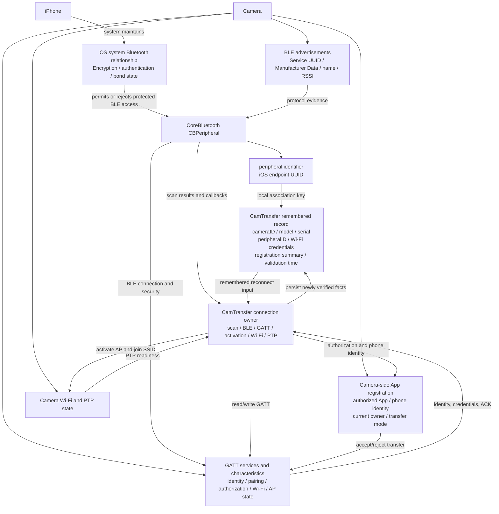
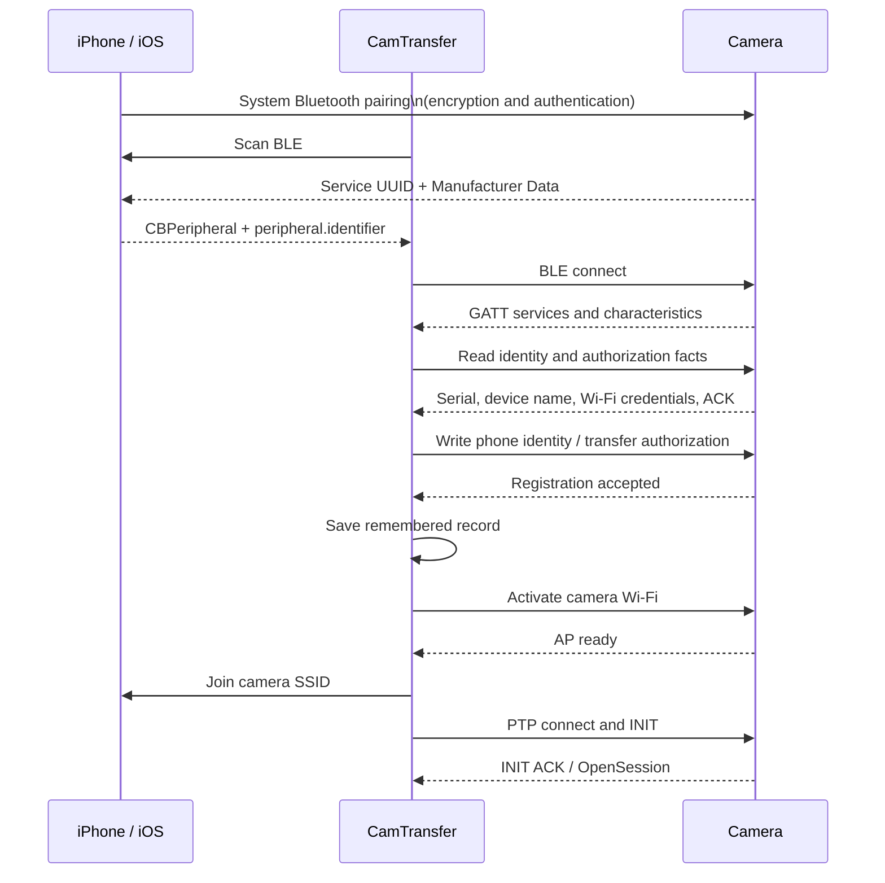
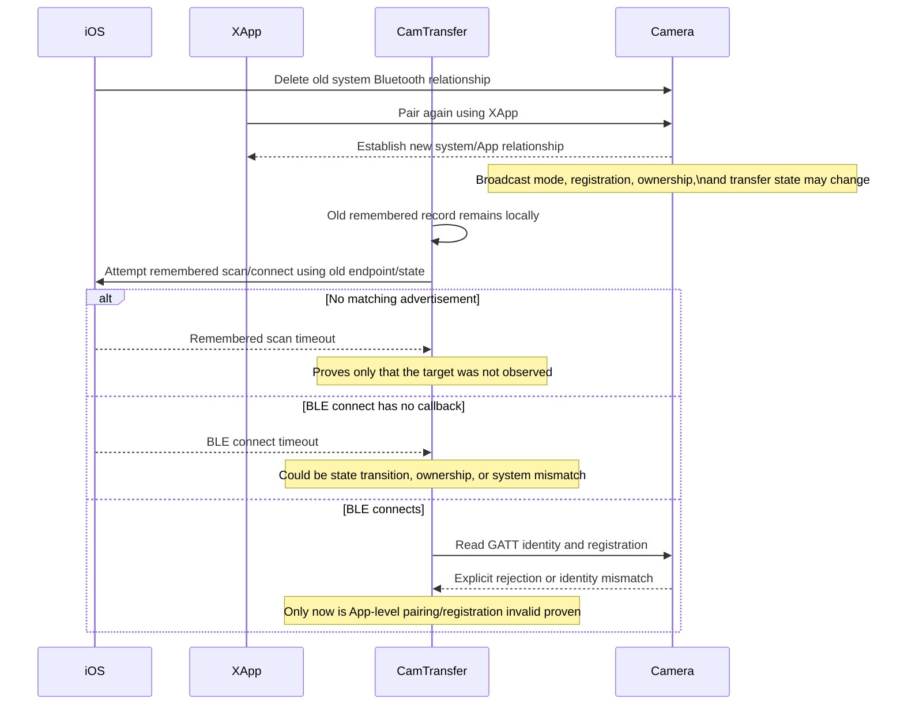

# iOS Fujifilm BLE protocol-based recognition design

Date: 2026-08-02

Status: evidence-reviewed; first implementation constrained by the explicit unknowns in section 1.2

## 1. Problem statement

The current iOS discovery path scans all BLE advertisements and then applies a generic matcher before it checks whether the peripheral is the remembered reconnect target. The matcher accepts a limited list of service UUIDs or a hard-coded Fujifilm model-name prefix list.

The 2026-08-02 X-M5 incident exposed two gaps at the same time:

- `X-M5` is not included in the `X-T`, `X-H`, `X-S`, `X-E`, `X-PRO`, and `GFX` name-prefix list.
- The camera advertised `SERVICE_FF_CONNECTED_DEVICE_INFORMATION_RED` (`123D8F06-62A1-4935-9322-833C531EE225`), which the current generic advertisement service map does not accept.

The App therefore observed the correct remembered peripheral but discarded it before the remembered-target check. It timed out in `ReconnectPairedBle` and never entered Wi-Fi or PTP.

This design replaces model-name admission with protocol evidence and verified camera identity. It must not create a second BLE connection owner or a second connection state machine.

### 1.1 Evidence baseline

The official comparison available in this repository is the Android FUJIFILM XApp `2.7.3(1)`, version code `63`, not the official iOS XApp. Version evidence is in `.analysis/xapp/jadx/sources/com/fujifilm/xapp/BuildConfig.java:21` and `.analysis/xapp/jadx/resources/AndroidManifest.xml:3-4`.

Evidence levels used below:

- **Confirmed XApp**: directly visible in the Android XApp decompiled source.
- **Confirmed device**: directly visible in the supplied X-M5 diagnostic log.
- **Confirmed iOS**: directly visible in the current CamTransfer iOS source or existing device logs.
- **iOS safety rule**: a deliberately stronger local invariant; it is not presented as XApp behavior and must have a focused test plus physical-device proof.
- **Unproven**: no implementation is allowed in the first change.

Implementation traceability gate: every production validation branch must map to one confirmed matrix row or one explicitly labeled iOS safety rule. Its focused test must use the matching captured advertisement/GATT fixture or assert the stated safety invariant. Unproven fields may be parsed and logged for diagnosis, but they cannot select a camera, pass identity, or advance connection state.

| Rule | XApp source | X-M5 log | iOS source | Evidence level | Implementation decision |
|---|---|---|---|---|---|
| Scan services depend on `PAIRING`, `RE_PAIRING`, or `RE_CONNECT` intent | `BTManager.java:186-319` | Fresh pairing uses `A9D2`; remembered X-M5 advertises `123D` | Current scan is unfiltered and post-filters advertisements | Confirmed XApp + device | Introduce intent-aware protocol profiles; do not use one generic model matcher for every intent |
| XApp dispatches advertisements by Fujifilm service UUID | `BTManager$leScanCallback$1$onScanResult$1.java:252-355` | `X-M5 + 123D` is repeatedly observed | `CameraVendorDeviceMatcher` accepts a fixed service map or model prefix | Confirmed XApp + device + iOS | Service role is the discovery-admission key; product name is display data only |
| Fujifilm manufacturer identifier is `1240 / 0x04D8`; type `1` is a five-character short serial and type `2` is a four-byte pairing key | `BTConstansKt.java:98-107`; `BTManager.java:637-674` | `D804013144353633` decodes as company `D8 04`, type `01`, short serial `1AD63` | Current parser only extracts type `02` pairing tokens | Confirmed XApp + device + iOS | Parse the platform framing correctly and expose typed evidence; parsing does not by itself authorize reconnect |
| RED remembered reconnect requires the saved endpoint and `123D...` | `BTManager.java:706-715`; `BTManager.java:1189-1220` | Saved ID `42D39012-FB38-3F92-C07A-53625FCCAB90` and the ignored `123D` advertisement have the same ID | Remembered-ID matching occurs only after the generic matcher | Confirmed XApp + device + iOS | For the first implementation, RED scan reconnect accepts only `123D + exact saved peripheral.identifier` |
| Old-protocol reconnect uses serial evidence and verifies the serial again after a GATT read before the pairing-key write | `BTManager.java:1065-1106`; `BTCamera.java:3308-3383` | Not exercised by this X-M5 incident | Existing iOS has a full-serial read and stored-identity policy | Confirmed XApp, not X-M5 | Preserve existing legacy behavior; do not generalize RED short-serial behavior from the old-protocol path |
| XApp performs a separate model/firmware support check after GATT data is available | `BTManager.java:1334-1354`; `BTCamera.java:3504-3542` | X-M5 reaches GATT and exposes model/serial in the successful pairing path | Current iOS discovery matcher conflates discovery with model recognition | Confirmed XApp + device + iOS | Protocol discovery means candidate only; compatibility remains unconfirmed until required GATT capabilities and downstream protocol steps succeed |
| Current iOS drops X-M5 before remembered-ID matching | No XApp equivalent; this is the defect under review | Log lines `2517-2528` and `2543-2552` show exact saved ID, `123D`, then timeout | `CameraVendorBluetoothService.swift:2321-2442` and `4490-4550` | Confirmed device + iOS | Reorder admission so an intent-valid exact remembered endpoint is evaluated before model-name classification |
| A changed CoreBluetooth identifier can be recovered from RED short serial | XApp parses the field but RED `RE_CONNECT` still checks the saved Android address | No changed-ID recovery was demonstrated | No proven mapping from five-character short serial to stored full serial | Unproven | Excluded from the first implementation; require fresh pairing if the saved endpoint is stale |
| A single Fujifilm protocol candidate may be connected when no identity evidence matches | No confirmed XApp path | Not demonstrated | Proposed only by the earlier design | Unproven | Excluded from the first implementation; never select by count, RSSI, or product name |
| Read full GATT identity before any pairing mutation or Wi-Fi activation on remembered reconnect | Old protocol reads and checks serial before its pairing-key write; RED parity is not proven | X-M5 log reads full serial `26042341B31011D563` before connected-device-name and identification writes | Current iOS can read `2A25`/`2A00`, but performs its final stored-identity check later | Confirmed capability + iOS safety rule | Add a read-only remembered-identity gate before connected-device-name, identification ACK, transfer activation, or Wi-Fi writes; fail closed on missing/mismatched required identity |
| Reuse the just-verified live GATT session | No direct XApp reuse/TTL proof found | Pairing succeeds, then Gallery immediately resets and disconnects at lines `2517-2524` | Current owner retains peripheral, characteristics, ACK state, and identity | Confirmed local defect + iOS safety rule | Reuse only while the same live connection, required characteristics, ACK, identity, and generation remain valid; no time-based TTL |
| Official iOS XApp uses the same endpoint rules | Android exposes a BLE address; CoreBluetooth does not expose it | Not observable from the supplied log | No official-iOS static/runtime capture is available | Unproven | Do not claim exact official-iOS parity; keep this as an explicit evidence gap |

### 1.2 Remaining unknowns and gates

The following are still unknown and must not be guessed:

1. Whether official iOS XApp uses a CoreBluetooth identifier, manufacturer short serial, another GATT field, or private persisted state when its endpoint changes.
2. Whether every supported RED camera exposes readable `2A25` and `2A00` before any mutation. X-M5 and existing X-T5 device logs prove this for those two cameras only.
3. The exact XApp RED post-connect identity rule before its first write. The Android source proves saved-address selection but not a full serial comparison at the same boundary.
4. The full supported-model/firmware table and capability policy used by XApp. Removing the discovery whitelist must not bypass compatibility checks.

These unknowns do not block the narrow X-M5 fix because its saved CoreBluetooth identifier is stable in the failing attempt, it advertises the confirmed RED reconnect service, and it exposes the full serial before writes. They do block changed-identifier recovery and any claim of universal future-model compatibility.

### 1.3 Relationship model: iOS, BLE endpoint, App record, and camera state

The connection cannot be modeled as one "Bluetooth pairing record". Four related but independent layers must be distinguished:



The relationships are established by different content and must not be conflated:

| Relationship | Linking content | Meaning and limit |
|---|---|---|
| iOS ↔ camera system Bluetooth | OS-managed encryption keys and authentication state | App cannot treat its local record as proof that this relationship is still valid |
| iOS ↔ BLE peripheral | `CBPeripheral` and `peripheral.identifier` | Endpoint selector only; not MAC, serial number, pairing key, or registration |
| Advertisement ↔ candidate | Service UUID, manufacturer payload, local name, RSSI | Discovery evidence; does not prove camera identity or App authorization |
| CamTransfer ↔ remembered record | `peripheralID`, `cameraID`, serial, model, Wi-Fi fields | App memory used to locate and validate a camera on the next run |
| CamTransfer ↔ camera identity | GATT device name and full serial read | Read-only identity gate before mutation or Wi-Fi activation |
| CamTransfer ↔ camera registration | Phone identity, authorization characteristic, handshake ACK | Proves the camera accepts CamTransfer at the application layer |
| CamTransfer ↔ camera Wi-Fi | SSID, passphrase, BSSID, AP-state evidence | Network handoff; independent of BLE pairing validity |
| CamTransfer ↔ PTP | Camera IP, port 55740, INIT ACK, OpenSession | Media transport; failure here must not erase BLE pairing |

The normal ordered relationship is:



`peripheral.identifier`, the iOS system Bluetooth relationship, the CamTransfer remembered record, and the camera-side registration are therefore four different facts. A valid connection requires all relevant facts to be compatible; one layer cannot be used as a proxy for another.

### 1.4 External-App re-pairing and stale local state

The important XApp experiment is modeled as a multi-layer state change:



After XApp re-pairs, the following may change independently: the iOS bond, the camera-side XApp registration, the camera's advertisement mode, current connection ownership, and transfer/AP state. CamTransfer's old remembered record does not automatically update. Consequently, a CamTransfer BLE timeout is a symptom of an unresolved cross-layer state mismatch, not by itself proof that the system pairing key is invalid.

The required decision sequence is:

```text
remembered record exists
  -> target advertisement observed?
  -> BLE connected?
  -> explicit system encryption/authentication error?
  -> GATT identity matches?
  -> CamTransfer registration explicitly accepted?
  -> only then activate Wi-Fi and start PTP
```

### 1.5 Failure classification and user action boundary

记忆连接扫描窗口结束时必须区分两种终态：扫描窗口内没有任何可识别的相机广播时，归类为 `noAdvertisement`，提示用户唤醒/重启相机并重试；收到相机广播但没有匹配保存的 `peripheralID` 时，归类为 `rememberedEndpointNotMatched`，提示原有连接记录已失效并引导重新建立蓝牙连接或重新配对。`123D` Secure Pair 广播和 Fujifilm 厂商帧属于相机证据，即使 endpoint 不匹配，也必须计入第二类，不能继续归类为普通 scan timeout。只有 BLE 连接已经开始后收到明确认证/加密错误，才归类为 `pairing_invalid`。

The only failures that may directly require re-pairing are:

- explicit system errors: `insufficientEncryption`, `insufficientAuthentication`, or `peerRemovedPairingInformation`;
- after `BLE_CONNECTED`, a required GATT identity read succeeds but CamTransfer registration is explicitly rejected or the verified identity conflicts with the remembered record.

The following must not be classified as pairing invalid on their own: no advertisement, scan timeout, ordinary `didFailToConnect`, BLE connect timeout, ordinary disconnect, backgrounding, cancellation, handshake timeout, Wi-Fi timeout, PTP TCP failure, or PTP INIT ACK timeout.

For those uncertain or downstream failures, the owner performs bounded recovery, records the first missing barrier, and gives an actionable retry/restart-camera instruction. It must not silently delete a valid remembered record. This preserves the user's ability to recover from transient radio or camera-state problems while still making proven pairing loss actionable.

### 1.6 XApp-to-iOS gap analysis and optimization backlog

This is the implementation decision record. “XApp evidence” means behavior proven by the Android XApp 2.7.3(1) decompilation or Android device logs. It does not claim that the unavailable official iOS XApp has the same internal code.

| Capability | XApp evidence | Current iOS state | Gap | Required optimization | Blocking condition |
|---|---|---|---|---|---|
| Camera identity | cameraID is serial number plus product name; multiple records are stored | iOS stores serial, model, name and derives cameraID | Low | Keep cameraID as business key; never replace it with a BLE UUID | Verify serial fixtures |
| BLE admission | Pairing, re-pairing and reconnect use intent-specific services and manufacturer data | Protocol profiles and remembered endpoint matching exist; all entry points need audit | Medium | Route every scan through one intent-aware evaluator; name is display-only | Complete call-site audit |
| Bond conflict | XApp compares scanned BLE address with Android bonded devices and immediately asks the user to delete the old registration | iOS cannot enumerate the complete bond database; probe and explicit security errors are available | High | Add bounded pre-pairing probe; only explicit security or registration rejection may require re-pairing | iOS API limitation; physical experiment |
| Remembered reconnect | Directly connect the saved endpoint, then use restricted RE_CONNECT scan | iOS has retrieve-and-scan paths, but several direct connect calls remain | High | One managed BLE connect entry point carrying purpose, generation, timeout and terminal outcome | Every production connect call uses it |
| GATT identity gate | XApp reads camera information during pairing/reconnect | iOS has strict serial/name policy, but ordering needs branch proof | High | Identity read must precede registration writes, activation and Wi-Fi writes | Negative tests and device log |
| Registration | XApp writes phone identity and camera-side registration | iOS writes identifiers and saves records; external-App replacement recovery is incomplete | High | Explicit rejection/mismatch clears stale CamTransfer registration and routes to re-pair | Need rejection/mismatch trace |
| Exact Wi-Fi | XApp reads SSID, passphrase and BSSID and requests exactly that network | iOS main path uses BLE-derived credentials | Low | Preserve exact source; prohibit prefix guessing | Confirm XM5 diagnostic source |
| AP readiness | XApp waits for AP/transfer readiness before handover | iOS has readiness states; disconnect branches need review | Medium | Keep AP-ready separate and allow at most one recovery | XM5 state-transition test |
| PTP | XApp delegates INIT/OpenSession to native SDK; Android proves port 55740 and bounded retry | iOS implements PTP directly | Independent | Do not change PTP in XM5 BLE patch; preserve diagnostics | Same-camera XApp capture |
| Cancellation and stale callbacks | Flow is bounded and phase-owned | iOS has generation/timeout policies; probe teardown and direct branches need coverage | High | Exactly-once cancellation and terminal publication across scan, probe, BLE and recovery | Focused tests plus device cancellation |
| Failure UX | XApp stops at the current phase and gives a phase action | Some iOS paths still expose broad reconnectPairedBle errors | Medium | Publish typed scan timeout, BLE timeout, identity mismatch, registration rejection and activation failures | UI mapping test |

Priority:

1. P0 lifecycle completeness: unify every formal BLE connection under one owner, generation, timeout, cancellation and terminal event.
2. P0 re-pair boundary: complete the probe and explicit security/registration rejection path. Only this path may clear old CamTransfer registration.
3. P1 evidence and UX: separate scan timeout from connect timeout and expose the first missing barrier and user operation.
4. P1 physical validation: run the XApp re-pair experiment on the successful XM5 and distinguish scan-not-found, BLE-timeout and post-connect rejection.
5. P2 independent protocol work: investigate X100VI PTP INIT only with a same-camera XApp success trace.

### 1.7 Target XM5 implementation flow

The target flow is:

`remembered record`
  -> validate cameraID, serial, endpoint and Wi-Fi source
  -> cancel and join pairing probe
  -> reuse a verified live session when possible
  -> otherwise retrieve the saved peripheral and use managed direct connect
  -> on bounded direct failure, run intent-aware restricted reconnect scan
  -> accept only protocol evidence plus the saved endpoint
  -> perform read-only GATT identity verification
  -> perform registration and transfer authorization
  -> activate camera Wi-Fi and wait for AP ready
  -> continue the existing Wi-Fi/PTP/Gallery path

User action is selected from the terminal barrier:

- remembered scan timeout: check camera power/transfer mode and retry; offer CamTransfer re-pair if another App was just used.
- BLE connect timeout: cancel old ownership and perform one bounded recovery; do not automatically delete pairing.
- explicit security error: mark pairing invalid and require re-pair.
- identity mismatch or registration rejection: clear CamTransfer stale registration and require re-pair.
- activation, Wi-Fi or PTP failure: remain in that phase and retry there; never erase BLE pairing as a side effect.

### 1.8 Remaining blockers and completion gates

1. Every formal central.connect call must use the managed owner. Pairing probe may have a separate purpose, but still needs bounded timeout and exactly-once teardown.
2. No current log proves that XApp re-pairing causes a specific CamTransfer registration rejection. Until that trace exists, scan-not-found and timeout remain non-pairing-invalid.
3. iOS does not expose Android's bonded-address list. The replacement is a probe plus explicit CoreBluetooth/GATT evidence, not a guessed bond query.
4. Run the physical sequence: CamTransfer paired, delete Bluetooth, XApp pair, CamTransfer reconnect, CamTransfer re-pair. Logs must identify the failing barrier.
5. The successful XM5 cannot prove the two failing devices are fixed; a diagnostic TestFlight build and fresh logs remain necessary.
6. X100VI PTP INIT ACK failure is outside XM5 BLE scope.

Completion requires separate proof of source implementation, focused tests, full regression review, signed iPhoneOS build, successful-XM5 normal and controlled-failure experiments, TestFlight distribution, and A/B logs identifying or clearing the original barrier.

### 1.9 Scope review verdict before implementation

The reviewed scope is accepted only because every item directly supports the XM5 objective: identify the first failed BLE barrier, recover transient connection state without destroying valid pairing, and route proven pairing loss to an actionable re-pair operation.

Included:

- managed lifecycle for all formal BLE connections;
- bounded pairing probe and explicit re-pair boundary;
- read-only identity gate before registration or transfer mutation;
- scan/connect/identity/registration terminal classification;
- generation-safe cancellation and late-callback suppression;
- physical validation and diagnostic TestFlight evidence.

Explicitly excluded:

- changing BLE payload order or unverified XApp protocol fields;
- treating every timeout or disconnect as pairing invalid;
- automatic short-serial or RSSI/name fallback;
- Wi-Fi, PTP, Gallery, download, or X100VI protocol changes;
- a second connection owner or parallel state machine.

Implementation order and stop conditions:

1. Add failing policy/source-structure tests for managed connect coverage and terminal classification.
2. Introduce the smallest managed-connect helper and migrate formal mainline/recovery call sites.
3. Keep pairing probe as a separate purpose with bounded timeout and teardown; it must never publish mainline success.
4. Run focused tests, then the complete RunnerTests suite; preserve the pre-existing build-number failure as a baseline issue.
5. Build and install the signed iPhoneOS app.
6. Run the successful-XM5 controlled scenarios before any TestFlight claim.

The implementation is not considered complete until the source, automated, build, install, successful-XM5, and A/B evidence gates are reported separately.

## 2. Goals

- Recognize supported Fujifilm cameras by confirmed BLE protocol evidence instead of enumerating model families.
- Preserve the single connection owner and the existing ordered flow:
  `ReconnectPairedBle -> TransferAuthorization -> ActivateCameraWifi -> WaitCameraWifiReady -> JoinCameraWifi -> ConnectPtp -> ConfirmGalleryMode -> LoadGallery`.
- Reuse a valid post-pairing or preconnected GATT session instead of disconnecting it and immediately scanning again.
- Treat an advertisement as a connection candidate, not as verified camera identity.
- Verify the camera through GATT before any Wi-Fi activation or PTP work.
- Support remembered reconnect when the CoreBluetooth peripheral identifier is stable. A changed identifier remains a fresh-pairing case until official-iOS or physical-device evidence proves a safe recovery key.
- Produce stage-specific diagnostics that distinguish no advertisement, rejected candidate, GATT failure, and identity mismatch.

## 3. Non-goals

- No changes to Wi-Fi joining, PTP/IP, Gallery, thumbnail, preview, or download protocols.
- No claim that every Fujifilm model is compatible merely because BLE discovery succeeds.
- No cross-brand abstraction in this change.
- No parallel legacy and new reconnect implementations.
- No name-only fallback that can connect to an arbitrary nearby camera.

## 4. Design principles

1. Service UUIDs and manufacturer formats are protocol constants and may be explicit. Camera model names are presentation data and must not control connection admission.
2. Discovery, candidate selection, GATT connection, identity verification, and transfer authorization are separate states.
3. `peripheral.identifier` is an endpoint selector, not a universal hardware identity. It is nevertheless the only confirmed RED reconnect selector available for the first implementation.
4. The durable identity remains the stored full serial plus device name. Remembered reconnect must verify the available full identity through read-only GATT operations before any mutating write.
5. The existing Runtime/Connection Worker remains the workflow owner. New types are pure profiles, parsers, policies, or evidence values only.
6. A stale callback from a cancelled scan, probe, or connection attempt must not advance a newer attempt.

## 5. Components

### 5.1 Fujifilm BLE protocol profile

Introduce a pure `FujifilmBleProtocolProfile` that centralizes only the advertisement services confirmed in XApp by intent:

- Fresh pairing: file-transfer (`AF85...`), RED camera-information (`A9D2...`), and the two X-Half pairing services.
- Non-pairing modes: file-transfer (`AF85...`) plus RED connected-device-information (`123D...`); startup-information services remain separate power/remote-boot evidence and are not silently promoted to identity.
- Home pairing validation: only services required to connect and read the validation characteristic.
- Pairing-ready rediscovery: secure-pair/file-transfer services and confirmed manufacturer pairing-key format.

The profile returns protocol roles, not product-family labels. `X-M5`, `X-T5`, and an unknown name can become protocol candidates under the same service rules, but candidate status is not a compatibility verdict.

### 5.2 Advertisement parser

Replace the current mixed name/service matcher with a parser that returns structured evidence:

- advertised service UUID roles;
- Fujifilm manufacturer identifier (`0x04D8`, represented as `D8 04` in the observed bytes);
- manufacturer payload type, including short serial (`type=0x01`) and pairing key (`type=0x02`) when present;
- local name for display and later comparison only;
- peripheral identifier and RSSI.

An unknown model name does not reject otherwise valid Fujifilm protocol evidence. Manufacturer type `0x01` and `0x02` are parsed as evidence only; neither one is accepted as a durable RED reconnect identity without an independently proven mapping.

### 5.3 Intent-aware candidate evaluator

Introduce a pure evaluator that accepts `connectionIntent`, parsed advertisement evidence, and an optional remembered record. It returns one of:

- rejected with a concrete reason;
- protocol candidate;
- preferred remembered candidate.

The first implementation has one permitted RED scan selection rule:

1. Advertisement contains `123D...` for remembered reconnect.
2. `peripheral.identifier` exactly equals the saved endpoint.

All other RED candidates are rejected with evidence. There is no short-serial recovery, single-candidate fallback, name fallback, or RSSI fallback. Old-protocol behavior remains on its existing branch until its advertisement fixtures and serial rules are separately captured in tests.

### 5.4 GATT identity verifier

After the exact remembered candidate connects, the existing handshake owner first performs read-only discovery and reads the full device name and serial number. It compares them with the stored full identity using a new strict remembered-reconnect rule, not the current permissive endpoint/name fallback order.

Only a successful full-identity match may start connected-device-name writes, identification ACK writes, transfer activation, or Wi-Fi activation, and only then may the connection worker publish `ReconnectPairedBle`. A missing required identity, read failure, or mismatch disconnects the candidate and records redacted expected/observed evidence.

This ordering is an iOS safety rule. It is supported by the X-M5 and X-T5 evidence that full serial data is readable before the current write sequence, but it is not described as exact RED behavior in Android XApp.

### 5.5 Reusable BLE session handoff

The existing Bluetooth service retains ownership of the live peripheral, discovered characteristics, handshake summary, and connection generation.

When pairing has just completed or a home preconnection remains valid, entering Gallery evaluates a pure condition-based reuse policy:

- peripheral is still connected;
- pairing confirmation ACK completed;
- required transfer-activation characteristics are still present;
- verified identity matches the remembered record;
- connection generation is current.

No arbitrary TTL is used. If all live conditions remain true, `ReconnectPairedBle` reuses the session. The flow must not call the destructive reset that cancels the selected peripheral. If any condition is false, the owner tears it down once and runs direct retrieval followed by constrained reconnect scanning.

### 5.6 Generation and operation admission

All pairing probe, scan, connect, and handshake callbacks carry or validate the active BLE connection generation. Starting a user connection:

1. closes probe admission;
2. cancels and joins probe cleanup;
3. either adopts a verified reusable GATT session or starts one reconnect attempt;
4. ignores callbacks from previous generations.

This preserves one executor and prevents probe teardown from racing the formal connection.

## 6. Connection flow

### 6.1 Remembered Gallery connection

1. Runtime receives the remembered camera intent.
2. Validate that the record contains stable camera identity and official Wi-Fi credentials.
3. Cancel and join any home pairing probe.
4. Attempt reusable-session adoption.
5. If not reusable, try `retrievePeripherals(withIdentifiers:)` and connect the saved endpoint within a bounded direct window.
6. If direct connection fails, scan only the profile services allowed for remembered reconnect.
7. Accept only the intent-valid service plus exact saved endpoint; record and reject every other candidate.
8. Connect that candidate and perform read-only full GATT identity verification.
9. Only after identity acceptance, allow pairing/identification mutation and transfer authorization.
10. Publish `ReconnectPairedBle` after the verified BLE stage, then continue the existing Wi-Fi, PTP, and Gallery sequence unchanged.

### 6.2 Fresh pairing

Fresh pairing uses the pairing intent's profile services and manufacturer evidence. Product names are displayed but are not admission rules. Pairing success produces the durable identity record and hands the valid GATT session to the same owner for optional Gallery reuse.

## 7. Error model and diagnostics

Replace the generic `未找到上次配对的相机` surface with stage-specific evidence:

- `no-protocol-advertisement`: no matching protocol service observed.
- `remembered-endpoint-not-observed`: saved endpoint was not observed before fallback.
- `candidate-rejected`: include service roles and rejection reason.
- `unsupported-fallback-required`: the saved endpoint is stale and only unproven fallback evidence was observed.
- `gatt-connect-failed`: CoreBluetooth connection error.
- `identity-read-failed`: required identity characteristics could not be read.
- `identity-mismatch`: connected camera differs from the remembered camera.
- `probe-teardown-timeout`: formal connection could not safely take ownership from the probe.
- `reusable-session-invalid`: include the failed reuse condition, then continue through normal reconnect.

Logs must state the connection intent, generation, selected route (`reuse`, `direct`, or `scan`), candidate evidence, and the last confirmed connection step. Secrets and full identifiers remain redacted in exported diagnostics.

## 8. Compatibility and migration

- Existing pairing records remain readable; no destructive migration is required.
- Records use the exact saved peripheral identifier for RED reconnect selection and the stored full serial/name for the read-only GATT identity gate.
- If the saved identifier is stale, the first implementation requires fresh pairing. Manufacturer short serial is logged as evidence but cannot auto-claim the camera.
- The old model-prefix matcher may remain only as UI classification/display support. It must not be used by remembered reconnect, fresh pairing admission, or identity verification.
- The current single-owner Runtime and ordered connection steps remain intact.

## 9. Test strategy

### 9.1 Pure policy tests

- X-M5 + `123D` is accepted for remembered reconnect.
- X-M5 + `A9D2` is accepted for fresh pairing.
- X-T5 and GFX advertisements remain accepted through protocol evidence.
- An unknown future model name with valid Fujifilm protocol evidence is accepted as a candidate.
- A Fujifilm-looking name without protocol/manufacturer evidence is rejected.
- Exact remembered endpoint is evaluated before generic display classification.
- Manufacturer short serial alone cannot select the remembered RED candidate.
- A single unmatched candidate and multiple unmatched candidates both refuse RSSI/name/count fallback.

### 9.2 State-machine and ownership tests

- Pairing-to-Gallery handoff does not cancel a valid connected peripheral.
- Invalid reusable sessions tear down once and enter reconnect.
- User connection cancels and joins the pairing probe before scanning or connecting.
- Stale probe/scan/GATT callbacks cannot advance a newer generation.
- Missing or mismatched remembered identity never writes connected-device name, identification ACK, transfer activation, or Wi-Fi activation commands and never confirms `ReconnectPairedBle`.
- Repeated connection requests do not create parallel scans or connects.
- Timeout and cancellation close pending continuations exactly once.

### 9.3 Regression tests

- Existing X-T5 pairing and remembered reconnect behavior remains green.
- Full `RunnerTests` passes, not only focused tests.
- `git diff --check` passes.
- Generic iPhoneOS build passes.

## 9.4 Diagnostic enhancement and repair boundary (2026-08-26)

Only evidence-supported defects are changed directly in this iteration. BLE writes now carry request IDs and generations, write callbacks record GATT success or error, and activation records a business confirmation separately. PTP requests and responses carry a connection session ID, socket ID, transaction correlation, and explicit response policy; transaction mismatch is recorded as a terminating policy decision. Wi-Fi association records interface, IPv4, gateway, and route/55740 reachability facts. These changes do not reorder commands, classify ordinary timeouts as pairing invalid, or add speculative blocking gates.

Items that cannot be distinguished from existing logs alone (the exact cause of `No route to host`, whether a PTP reset/mismatch is stale socket/concurrency/framing or a camera response, and whether an unsupported ObjectInfo response is intentionally continuable) receive diagnostics only. A fresh device reproduction must retain session, socket, request/response, user-action, and lifecycle correlation before changing behavior.

## 10. Physical-device acceptance

Code and simulator tests are not final proof. The change is complete only after fresh device evidence shows:

1. X-M5 fresh pairing succeeds.
2. Entering Gallery immediately after pairing reuses or safely adopts the BLE session and reaches GalleryReady.
3. App relaunch followed by remembered Gallery connection succeeds when the camera advertises `123D`.
4. Repeated `Gallery -> Home -> Gallery` and Quick Download loops succeed without a new pairing probe race.
5. Camera power-off/power-on produces a bounded reconnect failure and later recovery.
6. Background/foreground during reconnect does not create duplicate workers.
7. A second nearby Fujifilm camera is not mistaken for the remembered camera.
8. Changing/removing the saved endpoint does not trigger short-serial, count, RSSI, or name fallback; the flow requests fresh pairing.
9. X-T5 regression is run when the camera is available; otherwise the result must explicitly remain unverified for X-T5 physical compatibility.

Acceptance logs must prove the actual route, generation, candidate evidence, GATT identity result, ordered connection steps, and first Catalog success.

## 11. Expected implementation size and risk

This is a medium connection-layer change, not a full product rewrite:

- approximately four to six production files;
- one new pure profile/parser file or equivalent focused extraction;
- focused policy/state-machine tests plus full RunnerTests;
- no intended changes below BLE handoff in Wi-Fi/PTP/Gallery/download code.

Risk is medium because BLE lifecycle and cancellation are timing-sensitive. The design controls that risk through one owner, explicit generations, no name-only identity, no parallel implementation, focused regression tests, and physical X-M5 acceptance.
